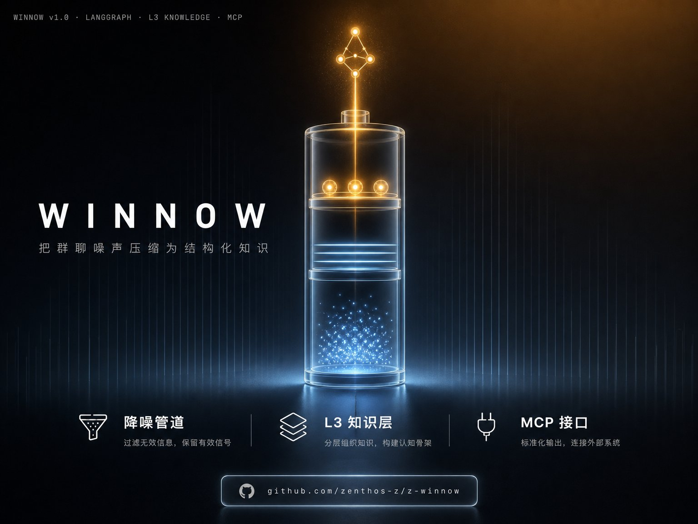

<p align="center">
  
</p>

# z-winnow

*把微信群聊噪声压缩为可消费的结构化知识——带长期群记忆、深度媒体解析、细粒度反馈，并通过 定制 MCP 、skill，链接汇聚群体智慧。*


[特性](#特性) • [架构](#架构概览) • [数据模型](#核心数据模型) • [快速开始](#快速开始) • [命令](#命令) • [MCP 接口](#mcp-接口) • [技术栈](#技术栈) • [文档](#文档)

---

> [!NOTE]
> 群聊 → LangGraph 降噪压缩管道 → **L3 核心知识层**（议题 / 资源 / 工程 / 日报并列产物）→ **MCP 接口**（`mcp.example.com`）→ 用户 / Agent。日报只是 L3 的一个产出视角；反馈经门槛过滤后驱动**版本化重生成**。

```
┌─ 本地计算节点（周期运行流水线）──────────────────────┐
│  群聊 → data_fetch → content_enrich → orchestrator   │
│          → unified_reporter → output_composer         │
│                       │                               │
│                       ▼                               │
│         L3 核心知识层（多产物 + 版本管理）  ← MemOS   │
└───────────────────────┬──────────────────────────────┘
                        │ sync push（L3 快照）/ pull（反馈）
                        ▼
┌─ ECS 常驻节点（7×24，公网 mcp.example.com）──────────┐
│  API key 鉴权 → FastMCP 6 工具 → 读 L3 / 写反馈 Inbox │
└───────────────────────▲──────────────────────────────┘
       外部 Agent / Claude / Cursor ── submit_feedback ──┘
                        │
            反馈 Inbox → 本地 pull → 版本化重生成（回路）
```

本地周期启停不影响公网服务：本地→ECS 推 L3 只读快照，ECS→本地拉反馈 Inbox，双轨单向。MCP 不暴露 MemOS，议题检索走 SQL `LIKE`。**附件**（图片 / PDF / 文件）上传 **Cloudflare R2 私有桶**，resource 记 `cloud_key`，MCP serve 时按需生成短期预签名 `cloud_url` 供远程下载——`sync push` 只推 L3 快照 + `cloud_key`，**不含附件二进制**（省带宽 / ECS 磁盘）。

---

## 特性

### 群记忆系统 —— 长期积累，可被纠正
不再每次从零开始，也不会越用越乱。MemOS 语义记忆（Qdrant 向量）按议题 / 资源 / 日报 / 自定义表分 cube 跨日沉淀，议题演化自动追踪。历史记忆**可纠正**——反馈经 MemOS 2.0 原生 `/product/feedback` 按 `target_type` 精准更新对应记忆节点，让记忆越用越准，而非越积越脏。

### 深度媒体解析 —— 不止于文字
群聊信息不止是文字。LLM Vision 分析图片内容、GIF 多帧抽取、卡片 / AppMsg 结构化解析、链接元数据预览、文件 SHA256 内容寻址落盘。当前覆盖文本 / 图片 / 链接 / 卡片 / 引用 / 文件；视频 / 音频 / 网页正文解析在规划中。

### 飞书一键上传 —— 产物直达多维表格
议题、资源、日报、工程表通过 Web UI 触发 lark-cli，一键推送到飞书 Bitable 多维表格（`TABLE_CATALOG` 驱动，加表即扩展），团队无需进系统即可即时共享。

### 按群定制分析 —— 匹配每个群的特点
不同群关注点不同。自定义表 registry（`TableDef` + Skill 提取 prompt）让你为每个群开启不同的分析维度——`engineering`（工程问题）、`world_models`（世界大模型动态）为内置实例，新增分析维度只需一条 YAML，按群开关激活。

### 细粒度反馈 + 自动经验化 —— 颗粒度到单条记录
反馈精确到单条议题 / 资源 / 表记录。提交反馈 → 版本化重生成（保留全部历史版本）→ 派生 `group_experiences` 群经验 → 经 `correction_loader` 自动注入下一次分析的提示词，让系统持续优化理解。全程四元组溯源、可逻辑回滚。

### MCP 协议 + 群体智慧 —— 群成员 AI 助理的统一入口
公网 `mcp.example.com` 让每位群成员都能用自己的 AI 助理（Claude Desktop / Cursor 等）调取群知识、参与反馈。所有人的反馈汇聚到同一份 L3，统一迭代、版本演进——**成员反馈沉淀为群体智慧的结晶**。附件（图片 / PDF / 文件）经 **Cloudflare R2 私有桶**短期预签名 URL 分发：远程 agent 调 `list_resources` 即可拿到可下载直链，私有桶不公开暴露、链接短期失效 + 须 MCP key 鉴权才能获取。

### 智能信息维护员（规划中）
独立的后台 Agent（非交互式），定期巡查 L3 数据之间的关联，做知识的二次压缩与结构化——自动维护 `knowledge_map`，建立议题间的承接 / 关联 / 反驳等关系，把"被动响应用户查询"升级为"主动维护群体知识网络"。基于对大模型能力边界与 AI 协作学习特性的理解设计；计划在阶段 5 引入（依赖跨议题、跨时间的语义对齐能力，当前单 agent 直线流水线尚不具备）。

> [!TIP]
> 更多工程能力：全链路 serverID 溯源（`winnow trace`，任一结论可回溯到原始消息）、Web 控制面板（FastAPI + 静态前端，clone 即用）、Mock 模式（`WINNOW_REAL_LLM=false`，无 API key 可跑全部测试）、key-based 鉴权（key → 成员 + 群组白名单 + 反馈署名绑定）。

---

## 架构概览

### 生产流水线（单 agent 直线）

```
START → data_fetch → content_enrich → orchestrator → unified_reporter → output_composer → END
         │              │                 │                  │                  │
         ▼              ▼                 ▼                  ▼                  ▼
  CipherTalk/WeFlow   XML/卡片/图片/      MemOS 上下文       单次 LLM 调用:      L3 JSON 持久化
   API → L1 入库      链接预览 → L2      (历史议题 +         · 议题摘要          (topic_summaries
   (raw_messages)     (parsed_contexts)  反馈修正 +          · 共享资源          + report_versions
                                        用户 core_topics)   · 日报概览/趋势     + 自定义表 JSON)
                                                             · 生命周期分类       + MemOS 入队
```

- **`unified_reporter`**：单次 LLM 调用完成议题 + 资源 + 日报 + 趋势 + 生命周期 + 按群启用的自定义表。
- **`output_composer`**：L3 JSON 组装 + `topic_summaries` / `report_versions` 写库 + MemOS 同步入队。
- **每阶段各自写存储**：`data_fetch`→L1、`content_enrich`→L2、`output_composer`→L3。
- **Markdown 渲染 / 飞书推送**不在主图，分别由 `export_markdown()` 与 Web UI 独立调用。

入口：`src/z_winnow/graph/builder.py` — `build_graph()` 返回编译后的图。

### 鉴权与权限模型

```
API key → member（member_id + display_name）+ allowed_groups（群组白名单）+ is_admin（全权）
  • middleware 提取 key（x-api-key 或 Authorization: Bearer）→ 注入 MemberInfo（contextvars）
  • 6 工具按白名单过滤；admin 全权；越权 → ToolError
  • submit_feedback.reporter = member_id（由 key 绑定，调用方无法伪造）
  • stdio 本地：admin 兜底（开发者全权）；ECS http 无 key：拒绝裸连
```

key 注册表 `config/mcp_keys.yaml` mtime 热重载 —— 加 / 改 / 撤 key 后 `winnow sync push` 推 ECS 即生效，无需 rebuild 容器。

---

## 核心数据模型

**三层 SQLite** —— L1/L2 当日快照不可变，**L3 升级为核心知识层**（多产物汇聚 + 版本管理；MCP 接口与 ECS 只读快照均读此层）：

| 层 | 表 | 写入节点 | 内容 |
|-------|-----|---------|------|
| L1 | `raw_messages` | data_fetch | CipherTalk 原始消息（serverID 溯源），不可变 |
| L2 | `parsed_contexts` | content_enrich | Token 边界内的上下文块（含图片分析 / XML / 卡片 / 链接预览），不可变 |
| L3 | `topic_summaries` + `data/processed/{group_id}/{date}/v{n}/*.json` | output_composer | 议题摘要、日报 / 资源 / 自定义表 JSON；按版本写 `v{version_number}/` 目录，重跑产新版本 |

**MemOS 长期语义记忆**（GeneralTextMemory 2.0，Qdrant + Redis）按内容类型细拆 cube：`winnow:{gid}:topics` / `:resources` / `:daily` 为固定内容节点；`winnow:{gid}:{table_id}` 为自定义表记录节点（registry 驱动、按群开关激活）。

**反馈与版本管理**：每个反馈 = 可溯源、可回滚的版本化事件，记录四元组（反馈内容 + 被反馈版本 / 议题 + 介入后新版本 + MemOS 节点）。提交反馈 →「根据反馈重生成」（弹窗预览 → 确认）→ 产新版本 → 回填溯源 + 派生群经验 + 记忆纠正。支持 `GET /feedback/{id}/provenance` 溯源、`POST /reports/{rid}/versions/{vid}/rollback` 逻辑回滚。

---

## 快速开始

三档递进，按需停在任何一档。完整细节见 **[部署指南](./docs/deployment.md)**。

### 第 ① 档：零依赖体验（10 分钟，无需任何 API key / Docker / 数据源）

```bash
git clone https://github.com/zenthos-z/z-winnow.git && cd z-winnow
poetry install --with dev
poetry run pytest tests/ -v --tb=short     # 全 mock 模式，应全绿
poetry run winnow web                      # 打开 http://127.0.0.1:8100/ui/ 逛控制台
```

想看带数据的完整效果？加载内置示例数据（完全虚构，见 [`examples/sample-data/`](./examples/sample-data/)）：

```bash
poetry run python examples/sample-data/seed.py
poetry run winnow web                       # 刷新即可浏览示例群的报告与数据
```

### 第 ② 档：接入真实 LLM 与数据源，产出你的群日报

前置：**Python 3.12+ / Poetry**、**LLM API key**（DeepSeek 默认，或任意 OpenAI 兼容端点 / Anthropic）、**群聊数据源 API**（CipherTalk `/v1/` 默认或 WeFlow——本项目消费消息 API，**不含消息采集**，需自备）。

```bash
cp .env.example .env        # 编辑：API key / 模型 / 数据源（每项均有注释）
poetry run winnow group add --chatroom-id 12345678@chatroom --display-name "我的群"
poetry run winnow ingest --date 20260814 --group "我的群"
# 或者用 Web UI（推荐，有 onboarding 向导）：poetry run winnow web
```

### 第 ③ 档：完整平台（长期记忆 + 定时调度 + 公网 MCP）

- **MemOS 群记忆**（跨日议题演化）：Docker 起 Redis + Qdrant + Neo4j + memos-api 四件套 → [部署指南 §4](./docs/deployment.md#4-memos-语义记忆可选推荐)
- **定时日报**：`poetry run winnow scheduler`（看板 + 向导，宕机自动补跑）→ [部署指南 §6](./docs/deployment.md#6-定时日报调度可选)
- **MCP 接口**：本地 stdio 直连 Claude Desktop / Cursor（最简），或 key-based 多人公网服务 → **[MCP 指南](./docs/mcp.md)**

> [!TIP]
> 配置优先级：`CLI 参数 > WINNOW_* 环境变量 > 标准环境变量 > .env > Field 默认值`（Web UI onboarding 向导写的 `data/config_overrides.json` 优先级最高）。Mock 模式：`WINNOW_REAL_LLM=false` 禁用 LLM 调用（测试自动启用），但**不替代数据源**——无数据源 API 时只能跑测试。

---

## 命令

### 核心命令

```bash
# 数据入库（单天）— 首次须先注册群组（见下方"群组管理"）
poetry run winnow ingest --date 20260428 --group "群聊名称"

# 溯源查询（serverID → L1/L2/L3 全链路）
poetry run winnow trace --server-id <serverID>

# Web 控制面板（FastAPI :8100；前端 http://127.0.0.1:8100/ui/）
poetry run winnow web

# MCP server（本地 stdio 集成 / 公网 http）
poetry run winnow mcp                                            # stdio（Claude Desktop / Cursor）
poetry run winnow mcp --transport http --port 8000 --host 0.0.0.0 # http（远程 / ECS）

# 日报配图（DMX Gemini 原生 API）
poetry run winnow gen-image --record-id <report_id>
```

<details>
<summary><b>进阶命令</b>（群组管理 / 数据同步 / API key / 质量评估 / MemOS 运维）</summary>

**群组管理** —— 群标识符双向解析（`group_id` ↔ `chatroom_id` ↔ 名称）

```bash
poetry run winnow group list                          # 列出所有已注册群组
poetry run winnow group resolve --name "群名"          # 群名 → group_id + chatroom_id
poetry run winnow group resolve --room-id xxx@chatroom # chatroom_id → group_id
poetry run winnow group add --chatroom-id xxx@chatroom --display-name "名称"  # 注册新群组（幂等）
```

**本地 ↔ ECS 数据同步**（MCP 公网服务数据通道）

```bash
poetry run winnow sync status          # 本地 vs ECS 行数对比 + 待 pull 计数
poetry run winnow sync push            # 推 L3 快照 + processed JSON + mcp_keys.yaml 到 ECS（排除 attachments/）
poetry run winnow sync push --dry-run  # 只生成本地快照，不传输
poetry run winnow sync pull            # 拉 ECS 反馈 inbox → merge 本地 → 清 inbox
poetry run winnow sync pull --dry-run  # 只 merge 报告，不清 ECS inbox
```

**对象存储 Cloudflare R2**（附件上传 / 回填；MCP 私有桶预签名下载）—— 本地 `.env` 配 S3 兼容读写凭证 + `WINNOW_R2_HTTPS_PROXY`（国内直连 SDK 读卡死，走 Clash 代理）；ECS 只读凭证经 `ecs-deploy.sh` merge 进容器 env（仅预签名，不发网络）。

```bash
poetry run winnow r2 status                                   # 配置就绪 + resources.json 已传/待传统计
poetry run winnow r2 upload                                   # 扫所有 resources.json，全量回填
poetry run winnow r2 upload --group <gid> --date 20260629     # 指定群 / 日
poetry run winnow r2 upload --dry-run                         # 只报告待传数，不传不写
```

**MCP API key 管理**（`config/mcp_keys.yaml`；改完 `sync push` 推 ECS）

```bash
poetry run winnow mcp-key list                                       # 列注册 key（脱敏）
poetry run winnow mcp-key add --member ID --name "名" --groups g1,g2 # 生成 key 绑成员+群权限
poetry run winnow mcp-key add --member admin --admin                 # 管理员 key（全权）
poetry run winnow mcp-key revoke --key wn_xxx                       # 撤销
poetry run winnow mcp-key allow --key wn_xxx --groups g3            # 追加可访问群组
```

**LLM-as-judge 质量评估**（4 维度打分）

```bash
poetry run winnow judge --group "群名" --from 2026-04-20 --to 2026-04-28  # 区间
poetry run winnow judge --group "群名" --date 2026-05-01                   # 单日
poetry run winnow judge --group "群名" --latest 10                         # 最近 N 份
```

**MemOS 运维**

```bash
poetry run winnow memos status                          # 健康状态 + cube 节点数
poetry run winnow memos rebuild --group X --from sqlite # 从 SQLite 重建 cube
poetry run winnow memos vacuum --group X                # 触发生命周期状态机扫描
poetry run winnow memos export --group X --out path/    # dump cube 到文件
poetry run winnow memos search --group X --query "..."  # 命令行查询调试
poetry run winnow memos flush                           # 强制处理 pending sync 任务
poetry run winnow memos delete-cube --group X -y        # 删除 :topics + :feedback cube 记忆
poetry run winnow memos purge-wxid --group X [--dry-run]# 清理含 wxid_ 的记忆节点
poetry run winnow memos wipe-all                        # 全量清空所有群记忆（开发调试）
```

**MemOS Docker 服务**（Redis + Qdrant + memos-api，启动必须带 `--env-file ../.env`）

```bash
cd deployments
docker compose --env-file ../.env up redis qdrant memos-api -d
docker compose ps
curl -s http://127.0.0.1:8000/docs    # 验证 API 可用
```

</details>

---

## MCP 接口

公网服务 `mcp.example.com`（FastMCP v3，6 工具 + key-based 鉴权 + 双库路由）：

| 工具 | 场景 | 关键参数 |
|------|------|---------|
| `list_groups` | 浏览可访问群组 | —（按 key 白名单过滤） |
| `search_topics` | 模糊检索议题 | `query`, `group_id?`, `date_from?`, `date_to?`, `limit?` |
| `get_topic` | 议题详情 + 演化时间线 + 相关反馈 | `summary_id` |
| `get_daily_report` | 日报回看 | `group_id`, `date`, `version?` |
| `list_resources` | 资源列表 | `group_id`, `date`, `version?` |
| `submit_feedback` | 提反馈（reporter 由 key 绑定） | `group_id`, `date`（必填锚点）, `target_type`, `signal`, `content` |

读工具查 L3（`topic_summaries` / `report_versions` / L3 JSON）；`submit_feedback` 写 feedback Inbox。ECS 双库：`l3_snapshot.db`（ro，mtime 懒重连）+ `feedback_inbox.db`（rw）。**附件下载**：`list_resources` / `get_daily_report` 对含 `cloud_key` 的资源现生成短期预签名 `cloud_url`（私有 R2 桶直链，默认 1h 失效），远程 agent 可直接下载图片 / PDF / 文件。

**`submit_feedback` 格式守门**：服务端做 schema 校验——`signal`（`correction`/`supplement`/`approval`/`stale`/`quality`）、`target_type`（`topic`/`report`/`trend`/`highlights`/`resource`/`section` ∪ 自定义表 id）、`date`（真实日历日期）、必填字段任一不符即拒绝（`ToolError`，**不写库**），错误消息一次性列出全部违规 + 合法取值，避免脏反馈污染 Inbox / 版本链。

**消费方接入（无需 GitHub）**：接入文档直接挂公网，绕开部分地区 GitHub 需代理的问题——

- `https://mcp.example.com/install` —— 自包含接入指南（拿 key → 配 MCP 客户端 → 连接自检 + 反馈预检）
- `https://mcp.example.com/feedback-format` —— 反馈 payload 权威规格 + 合法 / 非法示例

客户端配置（OpenClaw / Hermes / Codex CLI / Claude Desktop / curl / Python）与零依赖预检脚本（`validate_feedback.py`，提交前本地校验 payload）在 `.claude/skills/winnow-mcp/` 技能包。

---

## L3 产物类型

**固定产物**（每群恒开）

| 类型 | 说明 |
|------|------|
| 议题摘要 | 价值议题（背景 / 过程 / 结论三段式）+ 参与人 + 生命周期分类；跨日演化追踪（MemOS 沉淀） |
| 资源 | 分类提取：链接 / 论文 / 开源项目 / 文章 / 文档 |
| 日报 | 单天概览 + 讨论趋势（L3 的一个产出视角） |

**自定义表**（registry 驱动、按群开关激活、可扩展）：工程问题（`engineering`）、世界大模型动态（`world_models`）。

> [!TIP]
> 加新表 = 在 `custom_tables/` 加一条 YAML（`TableDef` 元数据 + Skill 提取 prompt）→ 自动出现在 unified_reporter 提示词、L3 JSON、MemOS cube、飞书表 catalog。议题 / 资源 / 日报是固定产物，engineering / world_models 是自定义表的内置实例（registry 槽位，非硬编码表）。

**输出通道**（非 L3 产物，独立触发）：Markdown 导出（`export_markdown`）、飞书 Bitable 上传（Web UI + lark-cli）、日报配图（DMX Gemini）。

### 内容增强管道（L1 → L2）

| 模块 | 说明 |
|------|------|
| `raw_message_parser` | 微信 XML 消息解析 + 类型归一化（ElementTree + 递归深度上限） |
| `card_parser` | 卡片 / AppMsg 解析（链接、小程序、文件等子类型） |
| `image_analyzer` | LLM Vision 图片分析（可回退 MCP `analyze_image`） |
| `link_fetcher` | URL 预览 / 链接元数据抓取（SSRF 防护） |
| `media_downloader` | 图片 / 表情 / 文件落盘（SHA256 内容寻址去重） |

当前支持文本 / 图片（Vision）/ 链接预览 / 卡片 / 引用 / 文件；视频 / 音频 / 网页正文解析为未来规划。

---

## 技术栈

| 组件 | 技术 |
|------|------|
| 编排引擎 | LangGraph ≥0.6.0（StateGraph，主流水线单 agent 直线） |
| MCP 网关 | FastMCP v3（6 工具 + middleware contextvars 鉴权 + 双库路由） |
| LLM | DeepSeek（默认，`deepseek-v4-flash`）+ OpenAI 兼容端点 + Anthropic，per-subagent 可配置 |
| 存储 | aiosqlite 三层 + Layer 3 JSON |
| 对象存储 | Cloudflare R2（S3 兼容，私有桶 + boto3 预签名 URL 分发附件） |
| 向量记忆 | MemOS（GeneralTextMemory 2.0，Qdrant + Redis，本地） |
| 数据模型 | Pydantic ≥2.0 + pydantic-settings |
| 模板 | Jinja2 |
| Web | FastAPI + uvicorn（后端）+ 静态 HTML / vanilla JS + Tailwind（前端） |
| 可观测 | LangSmith + structlog |
| 包管理 | Poetry |
| 部署 | Docker（Python 3.12） |
| 代码质量 | Ruff + MyPy + Bandit + pre-commit |

---

## 测试

```bash
poetry run pytest tests/ -v --tb=short                                     # 全部测试（mock 模式，无需 API key）
poetry run pytest tests/test_graph_builder.py::test_build_graph_returns_compiled -v  # 按名称
poetry run pytest tests/ -m "not slow and not integration and not e2e"    # 跳过慢速/集成/E2E
poetry run pytest tests/ --cov=src/z_winnow --cov-report=term-missing  # 覆盖率
pre-commit run --all-files                                                # 全部 pre-commit 检查
```

全 mock 模式（70 个测试文件）。pytest 配置：`asyncio_mode = "auto"`、`pythonpath = ["src"]`、`--strict-markers`；标记 `slow` / `integration` / `e2e`。

<details>
<summary><b>目录结构</b></summary>

```
z-winnow/
├── src/z_winnow/        # 主包
│   ├── cli.py                     #   CLI 入口
│   ├── graph/                     #   LangGraph 图构建（builder.py 主图）
│   ├── subagents/                 #   unified_reporter + output_composer
│   ├── pipeline/                  #   CipherTalk/WeFlow 客户端 + 3 层存储 + 溯源 + 版本管理
│   ├── mcp_server/                #   MCP 网关（FastMCP v3，6 工具 + key 鉴权）
│   ├── sync/                      #   本地↔ECS 同步（push/pull/status）
│   ├── object_storage/            #   Cloudflare R2 客户端（附件上传 + 预签名）
│   ├── content_enrich/            #   内容增强（XML/卡片/图片/链接/媒体）
│   ├── custom_tables/             #   自定义表框架（TableDef registry）
│   ├── memory/                    #   MemOS 适配器 + 同步队列 + 生命周期
│   ├── orchestrator/              #   任务编排入口（Web API 调用，非主图节点）
│   ├── outputs/                   #   配图生成 + Markdown 报告
│   ├── web/                       #   FastAPI 后端 + static/ HTML 前端
│   ├── config/                    #   pydantic-settings + 模型工厂 + 日志
│   ├── templates/                 #   Jinja2 模板
│   └── observability/             #   LangSmith + structlog
├── tests/                         # 测试（全 mock 模式）
├── schemas/                       # 输出 JSON Schema
├── docs/                          # 架构 / 前端 / API 文档
├── deployments/                   # Dockerfile + docker-compose + hf_cache4
├── .env.example                   # 环境变量模板
└── pyproject.toml                 # Poetry + Ruff/MyPy/Pytest/Bandit 配置
```

</details>

---

## 文档

| 文档 | 说明 |
|------|------|
| [MCP 接口指南](./docs/mcp.md) | 平台化定位、MCP / ECS / 鉴权架构、分阶段推进、changelog |
| [Web 前端架构](./docs/web-frontend-architecture.md) | 静态 HTML 前端架构、页面与 API 映射 |
| [API 速查](./docs/api-cheatsheet.md) | 端点速查表 |
