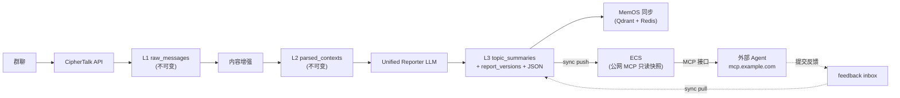
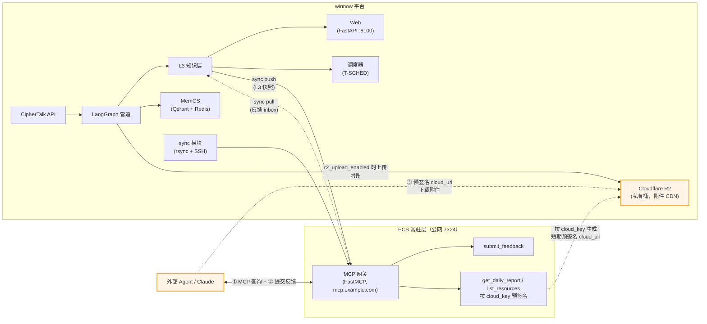
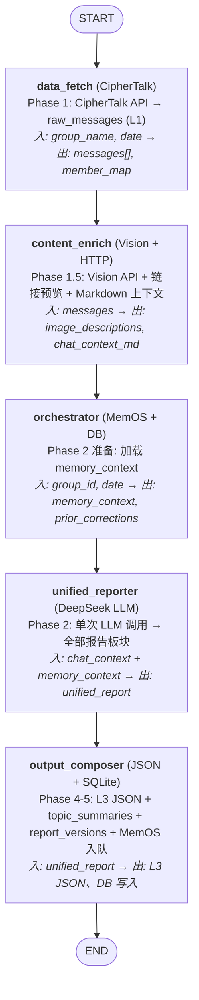
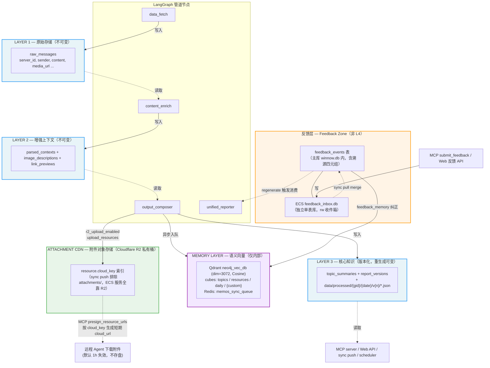
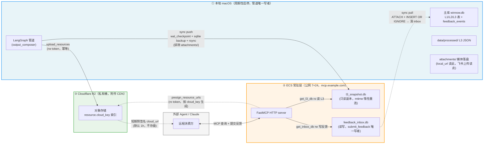
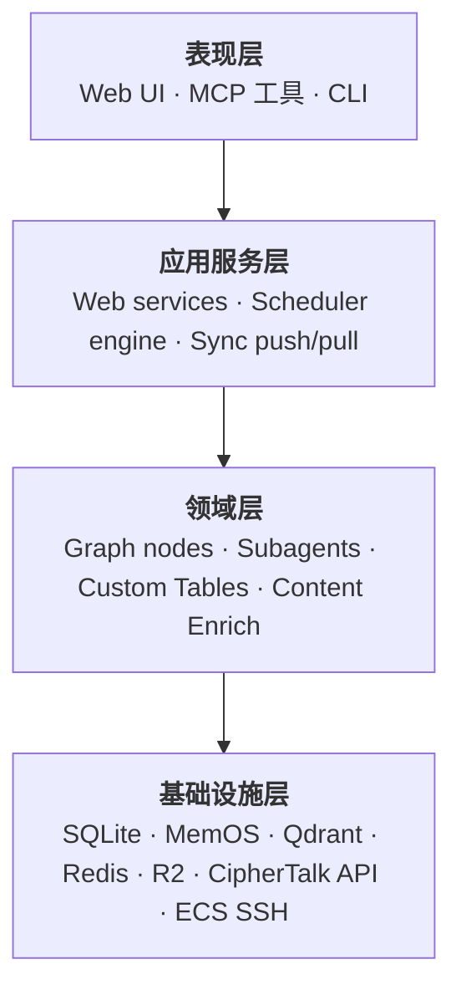
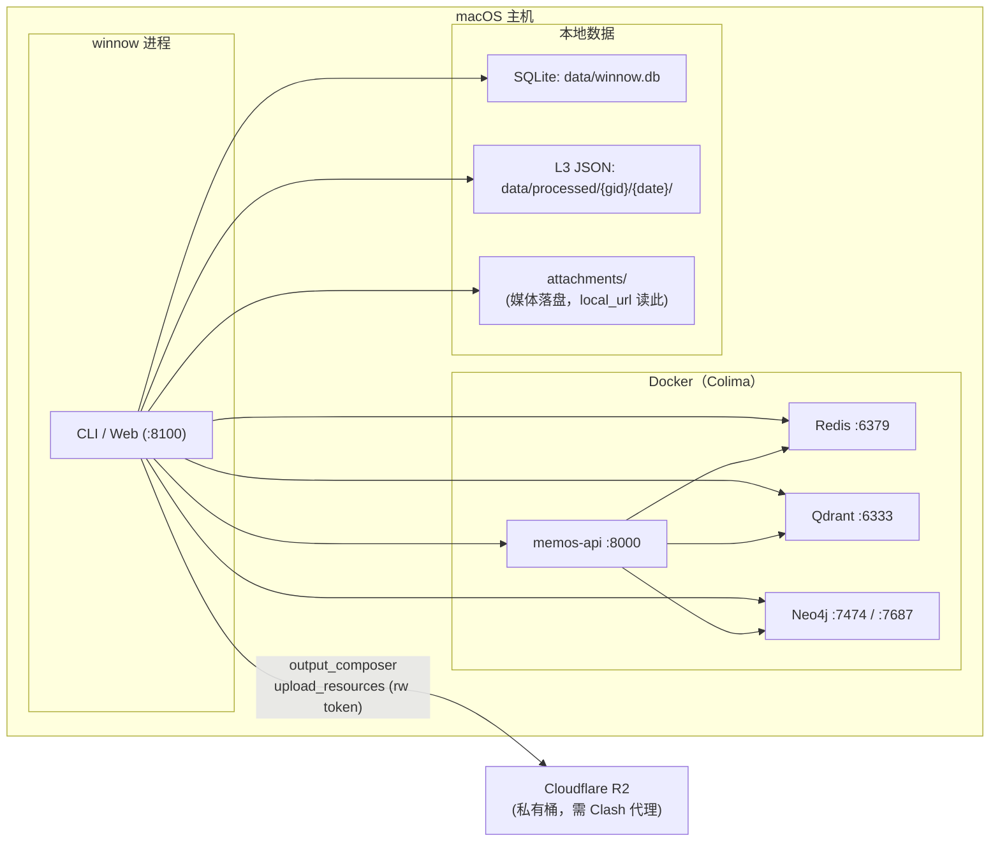
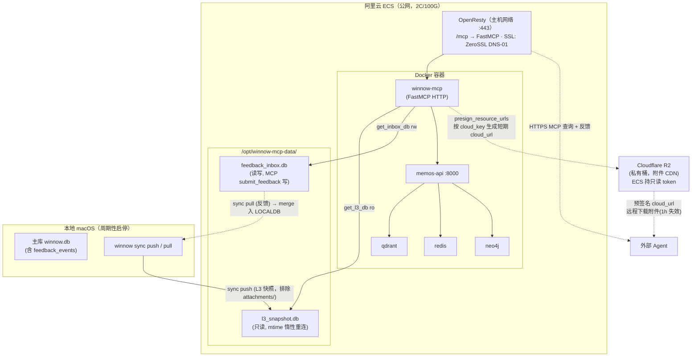

# 项目架构蓝图 — z-winnow

**生成日期**：2026-07-24  
**蓝图版本**：1.0  
**项目**：z-winnow — 信息降噪压缩平台  
**仓库**：`codelib/work/z-winnow/main`

---

## 目录

1. [架构检测与分析](#1-架构检测与分析)
2. [架构总览](#2-架构总览)
3. [架构可视化](#3-架构可视化)
4. [核心架构组件](#4-核心架构组件)
5. [架构分层与依赖](#5-架构分层与依赖)
6. [数据架构](#6-数据架构)
7. [横切关注点](#7-横切关注点)
8. [服务通信模式](#8-服务通信模式)
9. [技术专项架构模式](#9-技术专项架构模式)
10. [实现模式](#10-实现模式)
11. [测试架构](#11-测试架构)
12. [部署架构](#12-部署架构)
13. [扩展与演进模式](#13-扩展与演进模式)
14. [架构模式示例](#14-架构模式示例)
15. [架构决策记录](#15-架构决策记录)
16. [架构治理](#16-架构治理)
17. [新功能开发蓝图](#17-新功能开发蓝图)

---

## 1. 架构检测与分析

### 1.1 技术栈

| 层级 | 技术 | 版本 | 用途 |
|-------|-----------|---------|------|
| **语言** | Python | ≥3.12, <3.14 | 核心运行时 |
| **编排** | LangGraph | ≥0.6.0 | StateGraph 管道引擎 |
| **Agent 框架** | LangChain | ≥0.3.0 | 统一聊天模型、工具、结构化输出 |
| **LLM 提供商** | langchain-openai, langchain-anthropic | ≥0.3.0 | DeepSeek（主力）、Anthropic（视觉/回退）、OpenAI（兼容） |
| **MCP 服务** | FastMCP | ≥3.2 | 公网 MCP 网关（mcp.example.com） |
| **Web 框架** | FastAPI | ≥0.115.0 | REST API 后端（79+ 端点） |
| **Web 服务器** | Uvicorn | ≥0.30.0 | ASGI 服务器 |
| **校验** | Pydantic + pydantic-settings | ≥2.0 | Schema 校验 + 配置管理 |
| **数据库** | aiosqlite | ≥0.20.0 | 异步 SQLite（3 层存储） |
| **向量记忆** | MemOS（Qdrant + Redis + Neo4j） | 2.0.23 | 语义长期记忆 |
| **HTTP 客户端** | httpx | ≥0.28.0 | CipherTalk/WeFlow API 客户端 |
| **可观测性** | LangSmith + structlog | ≥0.2.0 / ≥24.0 | 追踪 + 结构化日志 |
| **定时调度** | croniter + Rich | ≥2.0.0 / ≥13.6.0 | 基于 Cron 的日报定时调度器 |
| **对象存储** | boto3（Cloudflare R2） | ≥1.34 | 附件 CDN（私有桶，预签名 URL） |
| **模板引擎** | Jinja2 | ≥3.1.0 | Markdown 报告渲染 |
| **图片处理** | Pillow | ≥11.0 | GIF 帧提取用于视觉分析 |
| **Token 计数** | tiktoken | ≥0.9.0 | OpenAI 分词器 |

### 1.2 检测到的架构模式

**主模式**：**管道（Pipe and Filter）** — 通过 LangGraph `StateGraph` 实现，线性节点链。

**辅助模式**：
- **分层架构** — L1→L2→L3 数据存储层，严格的不可变性规则
- **插件/注册表** — 自定义表框架（`TableDefinition` + `SkillDefinition` 注册表）
- **适配器** — MemOS 适配器（3 模式：真实/模拟/禁用），WeFlow↔CipherTalk 数据源适配器
- **策略** — LLM 提供商路由（deepseek/anthropic/openai），模型工厂
- **观察者** — SSE 流式推送管道进度，structlog 上下文传播
- **中间件** — FastMCP API key 鉴权中间件，FastAPI 错误处理中间件
- **仓库** — 通过 aiosqlite + WAL 模式访问 SQLite 数据
- **单例** — 线程安全 `get_settings()`，模块级缓存 + 锁

### 1.3 源码模块地图

```
src/z_winnow/
├── cli.py                          # CLI 入口（click 命令）
├── state.py                        # OverallState TypedDict + Message
├── graph/                          # LangGraph StateGraph 管道
│   ├── builder.py                  # build_graph() → CompiledStateGraph
│   └── nodes/                      # 图节点实现
│       └── recovery.py             # 子 Agent 超时/重试恢复
├── subagents/                      # LLM 子 Agent 实现
│   ├── unified_reporter/           # 单次 LLM 调用的日报 Agent
│   ├── output_composer/            # L3 JSON 合成 + 持久化
│   ├── contracts/                  # 子 Agent I/O TypedDict schema
│   └── incremental_prompt/         # 增量提示词组装
├── orchestrator/                   # 任务编排入口
│   ├── __init__.py                 # orchestrate() 主入口
│   └── orchestrator_loop.py        # 编排器 Agent 循环 + 辅助函数
├── pipeline/                       # 数据管道基础设施
│   ├── cipher_talk_client.py       # CipherTalk API 客户端（主数据源）
│   ├── weflow_client.py            # WeFlow 旧版 API 客户端
│   ├── database.py                 # SQLite schema 初始化 + 迁移
│   ├── context_assembly.py         # L2 上下文块组装
│   ├── l3_json.py                  # Layer 3 JSON 持久化
│   ├── provenance.py               # serverID 溯源
│   ├── feedback_consumer.py        # 反馈→重生成管道
│   ├── group_config.py             # 单群配置
│   └── sql_migrations.py           # Schema 版本管理
├── web/                            # FastAPI Web 应用
│   ├── app.py                      # FastAPI 应用工厂 + lifespan
│   ├── routes/                     # 16 个路由模块（约 79 端点）
│   ├── services/                   # 16 个服务模块（业务逻辑）
│   ├── schemas/                    # 16 个 Pydantic schema 模块
│   └── static/                     # 原生 JS + Tailwind 前端 SPA
├── mcp_server/                     # FastMCP 公网网关
│   ├── server.py                   # 6 个 MCP 工具 + 鉴权中间件
│   ├── mcp_keys.py                 # Key→成员+群组白名单
│   └── feedback_schema.py          # 反馈负载校验
├── sync/                           # 本地↔ECS 数据同步
│   ├── push.py                     # 推送 L3 快照→ECS
│   ├── pull.py                     # 拉取反馈 inbox→本地
│   ├── status.py                   # 行数比对
│   └── transport.py                # SSH/rsync 传输层
├── scheduler/                      # 基于 Cron 的日报定时调度器
│   ├── engine.py                   # DailyScheduler（tick/backfill/run_forever）
│   ├── preflight.py                # 环境健康检查
│   ├── views.py                    # Rich 仪表板渲染
│   ├── interactive.py              # 设置向导
│   ├── status.py                   # 共享状态数据层
│   └── cli_dispatch.py             # CLI 子命令分发
├── memory/                         # MemOS 语义记忆适配器
│   ├── adapter.py                  # MemOS 客户端（真实/模拟/禁用）
│   ├── sync_worker.py              # 异步同步队列 worker
│   ├── lifecycle.py                # Cube 生命周期管理
│   └── feedback_sync.py            # 反馈→记忆节点同步
├── custom_tables/                  # 基于插件的自定义表框架
│   ├── base.py                     # TableDefinition + SkillDefinition 数据类
│   ├── registry.py                 # 表注册 + 查询
│   ├── engineering.py              # 内置：工程问题表
│   └── world_models.py             # 内置：世界模型表
├── content_enrich/                 # L1→L2 消息增强
│   ├── __init__.py                 # node_content_enrich 入口
│   ├── xml_parser.py               # 微信 XML 消息解析
│   ├── image_analyzer.py           # Vision API 图片描述
│   ├── link_preview.py             # HTTP 链接预览抓取
│   └── media_downloader.py         # 媒体文件下载
├── config/                         # 配置管理
│   ├── settings.py                 # pydantic-settings（全部环境变量）
│   ├── model_factory.py            # LLM 模型实例化
│   └── logging_config.py           # Structlog 配置
├── outputs/                        # 报告输出生成
│   ├── markdown_writer.py          # Markdown 报告导出
│   └── image_gen.py                # DMX Gemini 图片生成
├── templates/                      # Jinja2 报告模板
│   ├── daily_report.md.j2
│   ├── engineering_report.md.j2
│   └── feishu_daily.md.j2
├── observability/                  # 监控与追踪
│   ├── langsmith_setup.py          # LangSmith 初始化 + trace 辅助
│   └── metrics.py                  # MetricsCollector + run 统计
├── rl/                             # ⚠️ 已废弃 — RL 训练（遗留）
└── object_storage/                 # Cloudflare R2 附件存储
    └── r2_client.py                # S3 兼容的 R2 客户端
```

---

## 2. 架构总览

### 2.1 系统定位

z-winnow 是一个**信息降噪压缩平台**。它将原始群聊消息转化为结构化、可查询的知识（L3 核心知识层），并通过公网 MCP 接口对外暴露，供外部 AI Agent 消费。

### 2.2 核心管道流程



### 2.3 架构指导原则

1. **分层不可变**：L1 和 L2 写入后即不可变。仅 L3 允许版本化更新（通过重生成 + 反馈回路）。
2. **单次 LLM 调用**：unified_reporter 一次 LLM 调用产出所有报告板块（概览、议题、资源、工程、自定义表）——无并行扇出，无合并节点。
3. **存储与格式化解耦**：L3 JSON 持久化与 Markdown 渲染分离（`export_markdown()` 为手动触发的 Phase H）。
4. **各阶段各自持久化**：每个管道节点立即写入自己的数据层（data_fetch→L1，content_enrich→L2，output_composer→L3）——无集中式 persist 节点。
5. **版本化重生成**：反馈触发版本化重生成（新版本号，旧版本保留）。报告版本通过 `is_active` 标志支持回滚。
6. **MCP 作为外部边界**：仅 L3 数据通过 MCP 对外暴露。MemOS（语义记忆）保持在内部。MCP 接口是唯一的外部消费渠道。
7. **优雅降级**：所有外部依赖（MemOS、LangSmith、Vision API、R2）不可用时优雅降级——管道绝不会因可选服务而硬失败。

### 2.4 架构边界

| 边界 | 执行机制 | 方向 |
|----------|----------------------|-----------|
| L1↔L2 | `raw_messages` 表写入后不可变 | 上游只读 |
| L2↔L3 | `parsed_contexts` 表写入后不可变 | 上游只读 |
| L3↔MCP | 仅暴露 `topic_summaries` + `report_versions` + L3 JSON | 外部只读 |
| 本地↔ECS | `sync push/pull` + WAL checkpoint + 原子 mv | 双向（推 L3，拉反馈） |
| MCP↔外部 | API key → 成员 → 群组白名单中间件 | 认证读 + 反馈写 |
| 管道↔Web | `orchestrate()` 函数调用（非 HTTP） | 进程内调用 |

---

## 3. 架构可视化

### 3.1 系统上下文（C4 Level 1）



### 3.2 管道图（C4 Level 2 — LangGraph StateGraph）



### 3.3 数据流（分层）



> **关于「L4」的澄清**（避免与历史命名混淆）：
> - **代码里的 "Layer 4"** 指**日报 Markdown 文件输出**（`outputs/report_writer.py`、`state.py::report_file_path` 注释），Wave 12 起已从主流程移除，降级为 Phase H 手动 `export_markdown()` 触发，**不是反馈层**。
> - **架构决策「砍 L4」**（见 `docs/mcp.md` §3.2 / L371 / L381，**用户定调**）：L3 即核心知识层，不再单起 L4；`knowledge_map` 等未来表也建在 L3 内。
> - **反馈数据**当前不属于 L1/L2/L3 任一管道产物层——它由 `feedback_events` 表（主库内）+ ECS `feedback_inbox.db`（收件箱）承载，是**独立的反馈层（Feedback Zone）**，由 MCP/Web 反馈路径写入，经 regenerate 回流进 L3 新版本。本蓝图按此实际形态呈现，**未把它命名为 L4**，以与既定决策一致。
> - 如需正式把反馈层命名为「L4」，需同步更新 `docs/mcp.md` 的「砍 L4」决策记录。

### 3.4 外部基础设施拓扑（本地 ↔ ECS ↔ R2 数据驻留）

本图专门展示三段外部基础设施的**数据驻留与流向**——谁是写者、谁同步、附件如何分发。



**驻留要点**：

| 设施 | 角色 | 写者 | 读者 | 同步 |
|------|------|------|------|------|
| **本地主库** `winnow.db` | L1/L2/L3 + feedback_events 真源 | 管道节点 + sync pull merge | Web API、CLI、sync push | — |
| **本地 `attachments/`** | 媒体落盘 | content_enrich 下载 | 本地 web (local_url)、飞书上传 (local_path)、R2 上传源 | **不进 rsync** |
| **ECS `l3_snapshot.db`** | L3 公网只读副本 | sync push（本地周期推） | ECS MCP 读工具 | 单向 push，mtime 懒重连 |
| **ECS `feedback_inbox.db`** | 反馈收件箱 | ECS MCP `submit_feedback` | sync pull（本地拉） | 单向 pull，两阶段清 inbox |
| **Cloudflare R2** | 附件 CDN（私有桶） | 本地 `upload_resources`（rw token） | ECS `presign_resource_urls`（ro token）→ 远程 Agent | **不经 rsync**，cloud_key 索引随 L3 JSON 同步 |

> **关键设计**：附件**不走 rsync 同步**——`sync push` 排除 `attachments/`。本地负责上传（rw token），ECS 只持有只读 token 做预签名，远程 Agent 通过短期 `cloud_url` 直连 R2 下载。这样 ECS 镜像保持小体积（仅 L3 文本 + JSON），附件分发由 CDN 承担。

---

## 4. 核心架构组件

### 4.1 LangGraph 管道（`graph/`）

**用途**：核心执行引擎——一个 `StateGraph`，编排从原始数据摄取到 L3 知识输出的 5 节点管道。

**内部结构**：
- `builder.py::build_graph()` — 工厂函数，返回 `CompiledStateGraph`
- 5 个节点：`data_fetch`、`content_enrich`、`orchestrator`、`unified_reporter`、`output_composer`
- 状态：`OverallState` TypedDict，含 30+ 字段，按生命周期阶段组织
- 错误处理：`errors` 字段使用 `Annotated[list, operator.add]` reducer——节点追加错误而不阻断管道

**交互模式**：
- 线性流：每个节点接收完整状态，返回部分状态更新
- LangGraph 将返回的 dict 合并进 TypedDict（⚠️ 未注册的 key 被静默丢弃）
- `@traceable` 装饰器用于 LangSmith 子步骤追踪
- 节点超时通过 `asyncio.wait_for` 执行（可按节点配置）

**演进模式**：
- 新管道节点通过 `add_node` + 边重配置插入到现有节点之间
- 节点实现在专用模块中（content_enrich、subagents 等），而非 graph/ 中
- 图在启动时编译一次；每次运行通过 `ainvoke()` 使用新鲜状态

### 4.2 统一报告器（`subagents/unified_reporter/`）

**用途**：单次 LLM 调用产出所有报告板块——概览、议题（含生命周期分类）、资源、工程问题、自定义表、趋势分析。

**内部结构**：
- `agent.py::generate_unified_report()` — 主入口：构建系统 + 用户提示词，调用 LLM，用 3 策略回退解析 JSON 输出（直接解析→代码栅栏提取→正则恢复）
- `models.py` — `UnifiedReporterOutput` Pydantic 模型，包含：`overview`、`important_notice`、`topics: list[Topic]`、`trend_analysis`、`trend_summary`、`highlights`、`resources: list[Resource]`、`custom_tables: dict[str, Any]`
- `prompt.py` — 从多个来源组装系统提示词：群配置、自定义表 YAML 提示词（从注册表动态加载）、修正历史（`group_experiences`，按严重性截断至 1500 token）、数据库中 core topics
- Token 预算管理（max_context_tokens 来自 settings，cl100k_base 分词器）
- 修正注入（用户提示词中 `<prior_corrections>` XML 块，按严重性排序）

**交互模式**：
- 接收：`chat_context_markdown`（来自 content_enrich）+ `memory_context`（来自 orchestrator）
- 产出：`unified_report` 字典——供 output_composer 消费
- 单次 `ainvoke()` 调用，`response_format="json_object"`——无内部子循环或工具调用
- LLM 输出渐进式回退解析：`json.loads()` → 从 ```json 栅栏提取 → 正则恢复

### 4.3 输出合成器（`subagents/output_composer/`）

**用途**：将统一的 LLM 报告转化为 L3 持久化产物——JSON 文件、SQLite 行、MemOS 同步队列条目。

**内部结构**：
- `compose_json()` — 将 unified_report 转化为版本化 L3 JSON 文件
- `persist_to_l3()` — 将 topic_summaries + report_versions 写入 SQLite
- `enqueue_memos_sync()` — 将节点推入 memos_sync_queue 供异步处理
- 自定义表路由：读取 `custom_tables` 状态字段以确定要写哪些 `{kind}.json` 文件

**交互模式**：
- 接收：`unified_report` 字典、`custom_tables` 配置
- 产出：文件系统写入（v{n}/ 目录）+ SQLite 写入 + MemOS 队列条目
- 确定性 `summary_id` 生成（INSERT OR REPLACE 实现幂等）

### 4.4 Web API（`web/`）

**用途**：FastAPI 后端，为 Web 仪表板和编程式管道触发提供 REST API。

**内部结构**：
- `app.py`：FastAPI 应用工厂，带 `lifespan` 上下文管理器（DB 初始化 + MemOS worker 启动）
- `routes/` 下 16 个路由模块，通过 `routes/__init__.py` 聚合
- `services/` 下 16 个服务模块（业务逻辑，与 HTTP 分离）
- `schemas/` 下 16 个 schema 模块（Pydantic 请求/响应模型）
- `static/` 处静态 SPA 前端（原生 JS + Tailwind，挂载于 `/ui/`）

**交互模式**：
- Route → Service → Database：路由处理 HTTP，服务处理逻辑，schema 处理校验
- DB 连接：单个 `aiosqlite` 连接存储在 `app.state.db_conn` 上，跨请求共享
- 管道调用：`POST /api/v1/runs` → `orchestrate()`（进程内函数调用，非 HTTP）
- SSE 流式推送：`GET /api/v1/runs/{id}/stream` 用于实时管道进度

### 4.5 MCP 服务（`mcp_server/`）

**用途**：`mcp.example.com` 公网 MCP 网关——知识消费的唯一外部接口。

**内部结构**：
- `server.py`：FastMCP 应用，含 6 个工具 + 基于中间件的鉴权
- `mcp_keys.py`：`MemberInfo` 数据类 + `resolve_member()`（YAML → key 查找 + 热重载）
- `feedback_schema.py`：`FeedbackSignal` 校验 + `validate_feedback_payload()`

**6 个 MCP 工具**：
| 工具 | 类型 | 说明 |
|------|------|-------------|
| `list_groups` | 读 | 列出可访问的群组（按 key 的群组白名单过滤） |
| `search_topics` | 读 | 在 topic_summaries 上做全文搜索（LIKE 查询） |
| `get_topic` | 读 | 按 summary_id 获取单个议题详情 |
| `get_daily_report` | 读 | 按群组 + 日期获取日报 |
| `list_resources` | 读 | 带过滤的资源列表 |
| `submit_feedback` | 写 | 追加反馈到 inbox（ECS）或本地 DB |

**鉴权模式**：
```
HTTP 请求（x-api-key / Authorization: Bearer）
  → _ApiKeyAuth 中间件（on_call_tool 钩子）
  → resolve_member(api_key, mcp_keys_path)
  → contextvars _current_member.set(MemberInfo)
  → 工具读取 _current_member.get() → 按 allowed_groups 过滤
  → 中间件退出时 contextvars 重置
```

### 4.6 调度器（`scheduler/`）

**用途**：基于 Cron 的日报定时调度器（T-SCHED）——独立于 Web 服务器。

**内部结构**：
- `engine.py::DailyScheduler` — 核心循环：tick → 检查 cron → 回填缺失 → 运行 → 自动推送
- `preflight.py` — 环境健康检查（Docker、容器、Qdrant、DB、LLM、数据源）
- `views.py` — Rich 终端仪表板
- `interactive.py` — Cron 配置的设置向导
- `status.py` — 共享数据层（CLI 和 Web 均消费）

**幂等性**：真源 = `report_versions(group_id, date)`，**不是** `pipeline_runs.group_id`（后者存的是 display_name，不是 UUID）。

### 4.7 自定义表框架（`custom_tables/`）

**用途**：基于插件的可扩展表系统——无需修改管道代码即可添加新的报告维度。

**内部结构**：
- `base.py`：`TableDefinition`（元数据 + schema + 渲染配置）+ `SkillDefinition`（提示词/agent 工作流）
- `registry.py`：全局注册表 — `register_table()`、`get_table()`、`get_active_tables_prompts()`
- 内置表：`engineering`（工程问题）、`world_models`（世界模型）

**扩展模式**：
```python
# 添加新的自定义表：
# 1. 定义 TableDefinition + SkillDefinition
# 2. 通过 register_table() 注册
# 3. 在 custom_tables/ 目录中添加 YAML 配置
# 4. 群组启用 → cube 自动出现在 MemOS 中
# 5. 飞书同步通过 TableDefinition 上的 feishu_fields 自动接通
```

### 4.8 同步模块（`sync/`）

**用途**：公网 MCP 部署的双向本地↔ECS 数据同步。

**内部结构**：
- `push.py`：WAL checkpoint → 备份快照 → rsync tmp → SSH 原子 mv（L3 快照 + processed JSON + mcp_keys.yaml）
- `pull.py`：Checkpoint ECS WAL → rsync inbox → ATTACH + INSERT OR IGNORE → DELETE 源（两阶段，无反馈丢失）
- `status.py`：行数比对（本地 vs ECS）
- `transport.py`：SSH + rsync 传输层

### 4.9 内容增强管道（`content_enrich/`）

**用途**：将原始 L1 消息转化为带有 AI 视觉描述和链接预览的增强型 L2 上下文块。

**内部结构**：
- `__init__.py::node_content_enrich()` — StateGraph 节点协调 4 个阶段：
  - **Phase A**：原始消息解析（messageKind 映射、XML 解析、回复目标提取）
  - **Phase A+/A++**：文件去重（来自 SMB 存储的 SHA256 哈希后缀）+ 媒体下载（图片/文件 → `attachments/`）
  - **Phase B**：通过 Vision API 批量图片分析（7 类分类，信号量限制为 5 并发）
  - **Phase C**：带 SSRF 防护的链接预取（20 并发，每 URL 超时限制）
- `image_analyzer.py`：双模式图片分析（LLM Vision API 为主，MCP `analyze_image` 为回退）
- `link_fetcher.py`：带内网 IP 过滤的 HTTP 链接元数据提取
- `raw_message_parser.py`：消息规范化（11 种消息类型：text、image、reply、link、appmsg、file、voice、video、emoji、weapp、location）
- `chat_context.py::ChatContextBuilder`：Markdown 格式化，含 AI 图片描述、回复引用和卡片消息元数据

**降级路径**：全功能 → 部分（仅链接，图片跳过）→ 禁用（原始消息直通）。重生成模式从现有 L2 记录恢复增强数据。

### 4.10 MemOS 适配器（`memory/`）

**用途**：对 MemOS 语义记忆（Qdrant + Redis + Neo4j）的抽象，支持优雅降级。

**内部结构**：
- `adapter.py`：基于 httpx 的真实适配器（连接池：最大 20，keepalive 30s）。每群 `asyncio.Lock` 用于写序列化。读方法传播异常；写方法容错。
- `types.py`：`MemOSAdapterProtocol` — `@runtime_checkable Protocol`，含 9 个方法（add、search、get_or_create_cube、add_structured、get_all、delete、feedback、scheduler_status、health_check）
- `factory.py`：`create_memos_adapter()` — P002 工厂，按 Settings 分发真实/模拟
- `mock_adapter.py`：内存 dict 存储，带调用计数器供测试断言
- `disabled_adapter.py`：静默无操作，返回空结果
- `sync_worker.py`：后台轮询器（fetch → mark_processing → dispatch → mark_done，至少一次语义，3 次重试）
- `lifecycle.py`：纯时间阈值扫描（14 天休眠，30 天归档，90 天删除）——无 LLM 依赖
- `feedback_sync.py`：反馈事件 → MemOS `/product/feedback` 原生纠正（双写：旧队列 + 新 API）
- `feedback_corrector.py`：将 `feedback_events` 映射到 `feedback_memory()` 调用，回填溯源信息（cube_id、node_id、archived_id）

**Cube 架构**：
| Cube ID 模式 | 内容 | 触发方式 |
|-----------------|---------|---------|
| `winnow:{gid}:topics` | 一议题一节点 | output_composer 入队 |
| `winnow:{gid}:resources` | 一资源一节点 | output_composer 入队 |
| `winnow:{gid}:daily` | overview/trend/highlights/notice | output_composer 入队 |
| `winnow:{gid}:{table_id}` | 自定义表记录 | output_composer 入队 |
| `{gid}:empty_days` | 空日信号 | lifecycle 管理 |

---

## 5. 架构分层与依赖

### 5.1 分层依赖规则



**依赖方向**：上层依赖下层。下层**绝不**从上层导入。

### 5.2 关键依赖规则

1. **`state.py` 是叶子节点**——被所有模块导入，不导入任何内部模块（仅 stdlib + typing）
2. **`config/` 是共享依赖**——`get_settings()` 在函数级调用（非模块级），避免导入时副作用
3. **`pipeline/` 不从 `web/` 或 `mcp_server/` 导入**——pipeline 是核心领域，表现层依赖它
4. **`graph/` 不从 `web/` 导入**——graph 是纯管道逻辑
5. **不存在循环依赖**——经导入图分析验证

### 5.3 依赖注入

- **Settings**：`get_settings()` 线程安全单例（模块级缓存 + 锁）
- **Database**：单个 `aiosqlite` 连接通过 `app.state.db_conn`（FastAPI）共享，或作为参数传递（CLI）
- **LLM 模型**：工厂函数 `create_model(provider, model_name)`——返回 `BaseChatModel`
- **MemOS 客户端**：工厂函数 `create_memos_client()`——按 `MEMOS_ENABLED` 返回真实/模拟/禁用

---

## 6. 数据架构

### 6.1 领域模型

```
Group（groups 表）
  ├── group_id：UUID（主键）
  ├── chatroom_id：str（CipherTalk 房间标识）
  ├── display_name：str
  ├── daily_schedule_cron：str | None
  └── feishu_tables：JSON blob（每群表配置）

Message → L1
  ├── server_id：str（全局唯一，主键）
  ├── group_id：UUID（外键 → groups）
  ├── date：str（YYYYMMDD）
  ├── sender、content、msg_type、timestamp、media_url
  └── [写入后不可变]

ParsedContext → L2
  ├── token 边界内的上下文块
  ├── 消息引用（server_id 外键 → raw_messages）
  └── [写入后不可变]

TopicSummary → L3
  ├── summary_id：str（确定性，主键）
  ├── group_id + date
  ├── title、description、lifecycle、participants
  └── [通过 report_versions 版本化]

ReportVersion → L3
  ├── report_id：str（group_id-date）
  ├── version_number：int
  ├── is_active：bool（当前生效版本）
  ├── content：TEXT | NULL（延迟到 Phase H 导出）
  └── source：str（daily_run | regenerate | manual）

FeedbackEvent
  ├── id：UUID（主键）
  ├── group_id + date
  ├── target_version_id：外键 → report_versions
  ├── target_topic_id：外键 → topic_summaries | NULL
  ├── produced_version_id：外键 → report_versions | NULL（重生成时回填）
  ├── status：pending | consumed | rolled_back
  └── 溯源四元组：（反馈、目标、产出、memos_nodes）

GroupExperience
  ├── group_id + content + is_active
  └── 派生自已消费的反馈（correction_loader 主数据源）
```

### 6.2 数据访问模式

- **SQLite**：直接 `aiosqlite` + WAL 模式。无 ORM——原始 SQL + 参数化查询。
- **Schema 迁移**：幂等 `CREATE TABLE IF NOT EXISTS` + `ALTER TABLE`，在 `pipeline/database.py` 中。启动时运行（web lifespan / CLI 命令）。
- **L3 JSON**：通过 `resolve_l3_dir()` 进行文件系统读取——优先 `v{n}/` 版本化目录，回退到扁平路径。
- **MemOS**：对 `memos-api:8000` 的 HTTP REST 调用——`/product/add`、`/product/search`、`/product/feedback`。
- **反馈数据双库**（非管道产物层，独立「反馈层」）：
  - **本地主库内 `feedback_events` 表**：含溯源四元组列（target_version_id / target_topic_id / produced_version_id / memos_cube_id / memos_node_id）。由 MCP `submit_feedback` / Web 反馈 API / `feedback_consumer` 写入，**不由管道节点写入**。
  - **ECS `feedback_inbox.db`**：独立单表库（WAL，读写），MCP `submit_feedback` 唯一写者。本地 `sync pull` 经 `ATTACH` + `INSERT OR IGNORE`（按 feedback_id 去重）merge 进主库 `feedback_events`，成功后清空 inbox（两阶段防丢）。
  - **回流**：`feedback_events` 经「根据反馈重生成」触发 `regenerate` → unified_reporter 产 L3 新版本 → 回填 `produced_version_id` + `mark_consumed` + MemOS `feedback_memory` 纠正对应 cube。

### 6.3 数据转换管道

```
CipherTalk API JSON
  → Message TypedDict（规范化字段）
  → raw_messages SQLite 行（L1，不可变）
  → parsed_contexts + image_descriptions + link_previews（L2，不可变）
  → chat_context_markdown（供 LLM 消费的单一字符串）
  → unified_report 字典（LLM 结构化输出）
  → L3 JSON 文件 + topic_summaries 行 + report_versions 行
  → MemOS 同步队列 → Qdrant 向量（异步，解耦）
```

### 6.4 缓存策略

- **Settings**：线程安全单例，对 `mcp_keys.yaml` 基于 mtime 热重载
- **L3 DB 连接**：惰性初始化 + ECS 部署基于 mtime 重连
- **无应用级缓存**：SQLite WAL + OS 文件缓存足以满足单进程访问

---

## 7. 横切关注点

### 7.1 认证与鉴权

**MCP 服务**：
- **模型**：基于 Key——每个 API key 映射到一个 `MemberInfo`（member_id、display_name、is_admin、allowed_groups 集合）
- **执行**：FastMCP 中间件（`_ApiKeyAuth`）拦截每次工具调用 → contextvars 注入
- **传输感知**：HTTP → 需要 key；stdio local → admin 兜底；stdio ECS → 拒绝
- **Admin key**：`is_admin=True` → 绕过群组白名单（全部群组完全访问）

**Web API**：
- 轻量级 API key cookie（`/api/v1/auth/*` 端点）
- 无生产环境鉴权——Web UI 设计为仅本地访问（绑定到 `127.0.0.1:8100`）

### 7.2 错误处理与韧性

- **图管道**：`errors` 字段使用 `Annotated[list, operator.add]`——节点追加错误，管道继续运行
- **节点超时**：`asyncio.wait_for()`，可配置超时（图节点默认 300s，子 agent 120s）
- **优雅降级**：
  - MemOS 不可用 → `memory_context = None`，管道以空记忆继续
  - LangSmith 不可用 → 追踪静默禁用（不报错）
  - Vision API 失败 → `image_analysis_failed = True`，图片保留为 `[图片]` 占位符
  - R2 上传失败 → 附件仅本地存储，同步跳过
- **重试**：`recovery.py` 提供带指数退避的子 agent 重试
- **反馈拉取**：两阶段协议（checkpoint → merge → delete）确保反馈不丢失

### 7.3 日志与监控

- **结构化日志**：`structlog` + contextvars 绑定（`run_id`、`group_id`、`date`）
- **每次运行独立日志**：`logs/runs/{date}/{run_id}.log`——每次管道调用的隔离日志文件
- **LangSmith 追踪**：LangGraph 节点自动追踪 + 手动 `@traceable` 装饰器
- **指标**：`MetricsCollector` 跟踪每次运行的时间、token 用量和错误计数 → `run_stats` 表
- **调度器心跳**：`scheduler_status` 表每次 tick 更新 → 在仪表板中可见

### 7.4 校验

- **Pydantic**：所有 API 输入通过 Pydantic 模型校验（web/schemas/、mcp_server/feedback_schema.py）
- **状态校验**：`OverallState` TypedDict 强制字段存在（LangGraph 静默丢弃未注册 key——这是已知陷阱）
- **配置校验**：`pydantic-settings` + `model_validator` 用于跨字段规则
- **反馈校验**：`validate_feedback_payload()` 确保 target_type + target_id 一致性

### 7.5 配置管理

- **优先级体系**（从高到低）：
  1. CLI 参数
  2. `WINNOW_*` 环境变量
  3. 标准环境变量（如 `ANTHROPIC_API_KEY`）
  4. `.env` 文件
  5. `data/config_overrides.json`（onboarding 向导写入）
  6. `Settings` 类中的 Field 默认值
- **密钥**：API key 在 `Settings.__repr__()` 中脱敏（仅显示前 4 + 后 4 字符）
- **热重载**：`mcp_keys.yaml` 在 mtime 变更时重载（无需重启）
- **功能开关**：`MEMOS_ENABLED`、`FEISHU_ENABLED`、`R2_UPLOAD_ENABLED`、`MCP_IMAGE_ANALYSIS`、`LANGSMITH_TRACING_V2`

---

## 8. 服务通信模式

### 8.1 内部通信（进程内）

| 模式 | 用途 | 实现 |
|---------|-------|---------------|
| **直接函数调用** | Web API → Pipeline | `orchestrate()` 直接调用（非 HTTP） |
| **状态图** | 管道节点间 | LangGraph `ainvoke()` + TypedDict 状态传递 |
| **异步队列** | Pipeline → MemOS | `memos_sync_queue` SQLite 表 + 后台 `asyncio.Task` |
| **SSE 流式推送** | Web → 前端 | `StreamingResponse` + 来自 `async_tasks` 的进度事件 |

### 8.2 外部通信

| 边界 | 协议 | 认证 | 方向 |
|----------|----------|------|-----------|
| CipherTalk API | HTTP REST（httpx） | Token 头 | 出站（读） |
| WeFlow API（旧版） | HTTP REST（httpx） | Token 头 | 出站（读） |
| MemOS API | HTTP REST（httpx） | API key | 出站（读/写） |
| Qdrant | gRPC/REST（端口 6333） | 无（本地） | 出站（读/写） |
| Redis | TCP（端口 6379） | 无（本地） | 出站（读/写） |
| ECS | SSH + rsync | SSH key | 出站（推/拉） |
| Cloudflare R2 | S3 API（boto3） | Access key | 出站（上传/预签名） |
| DMX Gemini API | HTTP REST（httpx） | API key（原生 Google） | 出站（生图） |
| DeepSeek API | HTTP REST（OpenAI 兼容） | API key（Bearer） | 出站（LLM 调用） |
| LangSmith | HTTP REST | API key | 出站（追踪） |

### 8.3 同步 vs 异步

- **同步（管道内）**：所有图节点在 `ainvoke()` 内同步执行。无 Send API 扇出。
- **异步（后台）**：MemOS 同步 worker、SSE 进度流式推送、调度器 tick、运行后自动推送（信号量限制为 4 并发）。
- **事件驱动**：反馈提交 → SQLite 插入（无即时处理）。`regenerate` API 显式触发消费。

---

## 9. 技术专项架构模式

### 9.1 Python 模式

#### 模块组织
- **按功能平铺**：每个主要子系统是 `z_winnow/` 下的顶级包
- **`__init__.py` 作为公共 API**：每个包的 `__init__.py` 导出其公共符号（类、函数）
- **惰性导入**：重型模块（MemOS、LangSmith）在函数级导入，非模块级

#### 异步编程
- **全面 `async/await`**：所有 I/O（SQLite、HTTP、文件操作）均为异步
- **`asyncio.create_task()`** 用于后台 worker（MemOS 同步、SSE 心跳）
- **`asyncio.Semaphore`** 用于并发限制（图片分析：5，自动推送：4）
- **`asyncio.wait_for()`** 用于超时执行（图节点、子 agent）

#### 依赖管理
- **Poetry**：单个 `pyproject.toml`，含 `[tool.poetry.dependencies]` + `[tool.poetry.group.dev.dependencies]`
- **无内置依赖**：所有包来自 PyPI
- **Python 3.12+**：使用最新 typing 特性（PEP 695 尚未采用）

### 9.2 LangGraph 模式

#### StateGraph 构建
```python
graph = StateGraph(OverallState)
graph.add_node("data_fetch", node_data_fetch)
graph.add_node("content_enrich", node_content_enrich)
# ... 更多节点
graph.add_edge(START, "data_fetch")
graph.add_edge("data_fetch", "content_enrich")
# ... 更多边
graph.add_edge("output_composer", END)
return graph.compile()
```

#### TypedDict 状态管理
- 所有状态字段在 `OverallState(TypedDict)` 中声明
- `Annotated[list, operator.add]` 用于累加器字段（errors）
- ⚠️ LangGraph 静默丢弃未注册 key——已知陷阱，记录在 `docs/experiences/lessons/`

#### 单 Agent 架构（Wave 12+）
- 无 Send API 扇出，无并行 agent，无合并节点
- `unified_reporter` 中一次 LLM 调用产出所有输出
- Orchestrator 是管道节点（准备工作），不是路由分发器

### 9.3 FastAPI 模式

#### 应用工厂
- `web/app.py` 创建带 `lifespan` 上下文管理器的 FastAPI 实例
- 数据库连接在 lifespan 中初始化，存储在 `app.state` 上
- 根路径重定向：`GET /` → 307 → `/ui/`
- 静态文件：`app.mount("/ui", StaticFiles(...))`

#### Route-Service-Schema 分离
```
routes/     → HTTP 关注点（路径参数、查询参数、状态码）
services/   → 业务逻辑（数据库查询、编排调用）
schemas/    → Pydantic 模型（请求校验、响应序列化）
```

#### 错误处理
- 通过 `@app.exception_handler(HTTPException)` 统一异常处理
- 结构化错误响应：`{"detail": str, "error_code": str | None}`

### 9.4 FastMCP 模式

#### 工具定义
```python
@mcp.tool()
async def search_topics(
    query: str,
    group_id: str | None = None,
    limit: int = 20,
) -> list[dict[str, Any]]:
    member = _current_member.get()
    # ... 鉴权检查 + 查询
```

#### 基于中间件的鉴权
- `Middleware.on_call_tool()` 钩子拦截每次工具调用
- `contextvars` 用于请求作用域的身份标识（async 无线程局部变量问题）

---

## 10. 实现模式

### 10.1 接口设计模式

- **TypedDict 用于数据契约**：`OverallState`、`Message`、`FeedbackSignal`——结构化但不受类绑定
- **Dataclass 用于配置对象**：`TableDefinition`、`SkillDefinition`、`MemberInfo`、`MemoryResult`、`CmdResult`、`TickResult`
- **Protocol 用于适配器接口**：`MemOSAdapterProtocol`（`@runtime_checkable`）——9 方法契约，3 种实现（真实/模拟/禁用）
- **Pydantic BaseModel 用于 I/O 边界**：`UnifiedReporterOutput`、`OutputComposerInput`/`OutputComposerOutput`（严格 `extra='forbid'`）、`QualityResult`
- **`__init__.py` 重导出**：公共符号在包级重导出以提供清晰的导入路径

### 10.2 服务实现模式

- **无状态异步函数**：Web 服务接收 `aiosqlite.Connection` 作为第一个参数（无类状态）。路由从不包含业务逻辑。
- **`orchestrate()` 作为门面**：单一入口点隐藏图构建 + 执行 + LangSmith 追踪 + run 日志
- **`auto_push_after_run()`**：发射后不管的后台推送（asyncio.create_task，信号量限制为 4 并发）
- **任务队列**：5 层架构（DDL → CRUD 辅助 → 后台执行器 → API 函数 → 副作用）。SQLite 支持，崩溃后存活。

### 10.3 仓库模式（SQLite）

```python
# 模式：直接 aiosqlite + 参数化查询
async def get_report_versions(
    db: aiosqlite.Connection, group_id: str, date: str
) -> list[dict[str, Any]]:
    cursor = await db.execute(
        "SELECT * FROM report_versions WHERE group_id = ? AND date = ? ORDER BY version_number DESC",
        (group_id, date)
    )
    rows = await cursor.fetchall()
    return [dict(row) for row in rows]
```

- 无 ORM——全程原始 SQL + 参数化查询
- `aiosqlite.Row` 工厂用于类字典的行访问
- WAL 模式支持写入期间并发读取
- Schema 迁移是幂等的（CREATE TABLE IF NOT EXISTS）

### 10.4 控制器/API 模式

- **Route → Service 委托**：`routes/*.py` → `services/*.py` → `pipeline/database.py`
- **P054 解析-校验-委托**：路由解析 HTTP 参数，Pydantic 校验，服务函数执行业务逻辑
- **L070 条件导入**：所有 route/service 导入包裹在 `try/except ImportError` 中，确保并行开发安全
- **P082 读写非对称鉴权**：GET/OPTIONS 直接通过；POST/PUT/PATCH/DELETE 需要 API key

### 10.5 领域模型模式

- **确定性 ID**：`summary_id` 由内容哈希计算，用于幂等 INSERT OR REPLACE
- **基于版本的变更**：L3 数据绝不原地更新——创建新版本，切换 `is_active` 标志
- **反馈四元组溯源**：每个反馈事件链接到：（1）原始反馈，（2）目标版本/议题，（3）产出版本，（4）MemOS 节点（cube_id + node_id + archived_id）
- **自定义表记录**：`{kind}_id` 由内容 MD5 生成，用于反馈 target_id 锚定

### 10.6 其他设计模式

| 模式 | 位置 | 实现 |
|---------|----------|---------------|
| **单例** | `get_graph()`、`get_settings()`、`get_db()` | 模块级缓存实例，双重检查锁定 |
| **工厂** | `create_model()`、`create_memos_adapter()`、`create_data_client()`、`create_unified_reporter()` | 按提供商路由的工厂，返回已配置实例 |
| **策略** | `MemOSAdapterProtocol` → 真实/模拟/禁用 | Protocol + 3 种可互换实现 |
| **装饰器** | `with_retry()`、`with_progress()`、`with_node_recovery()`、`@traceable` | 用横切行为包装异步函数 |
| **适配器** | `WeFlowClient(CipherTalkClient)`、`_ApiKeyAuth(Middleware)` | 将外部接口规范化为内部契约 |
| **注册表** | `custom_tables/registry.py`、`templates/renderer.py` | 全局字典 + 从 YAML 文件自动发现 |
| **观察者** | SSE 流式推送（`/runs/stream`）、structlog contextvars | 基于推送的进度 + 结构化日志传播 |
| **管道** | `StateGraph` 5 节点线性链 | 顺序阶段 + TypedDict 状态传递 |
| **惰性初始化** | P016 贯穿：`scheduler.__getattr__`、`memory.factory` | 重型模块在调用时导入，非导入时 |
| **信号量** | `DailyScheduler._sem`、`MemOSAdapter` 每群锁 | 并发限制 + 写序列化 |
| **中间件链** | FastAPI `ApiKeyMiddleware` + `ErrorHandlerMiddleware` | 请求管道：鉴权 → 错误映射 → 处理 |

---

## 11. 测试架构

### 11.1 测试组织

```
tests/
├── conftest.py                  # 共享 fixtures + pytest 标记 + autouse 中和器
├── test_graph_builder.py        # 图构建 + 节点测试
├── test_state.py                # State TypedDict 校验
├── test_e2e_api_01_*.py         # 11 个 E2E API 生命周期测试（有序）
│   至 test_e2e_api_11_*.py
├── test_*.py                    # 共约 65 个测试文件，全部 mock 模式
├── scheduler/                   # 调度器子包（5 个文件）
└── test_custom_tables/          # 自定义表子包（7 个文件）
```

### 11.2 测试模式

- **默认 Mock 模式**：`WINNOW_REAL_LLM=false`——所有测试无需 API key 即可运行
- **无共享数据工厂**：每个测试文件自行构造数据（内联字典或 `_make_*`/`_seed_*` 辅助函数）
- **默认异步**：`asyncio_mode = "auto"`——所有测试函数自动异步，无需 `@pytest.mark.asyncio`
- **SQLite 隔离**：`:memory:` 数据库或 `tmp_path` 临时文件。无共享持久状态。
- **P078 真实 SQLite :memory: 用于 DB 支持测试**：在所有数据库和 E2E 测试中使用
- **ASGITransport 用于 E2E**：FastAPI `AsyncClient` + `ASGITransport`——完整 HTTP 栈，无网络
- **Monkeypatch 优先于 Mock**：测试优先使用 `monkeypatch.setattr()` 在模块级引用上，而非 `unittest.mock`

### 11.3 关键 Fixtures

| Fixture | 作用域 | 用途 |
|---------|-------|---------|
| `_neutralize_config_overrides` | autouse，套件级 | 将 `Settings._load_overrides` 补丁为 `{}`——防止 onboarding 向导配置泄漏到测试中 |
| `_cleanup_mockmock_files` | autouse，套件级 | 清理因测试忘记在 mock settings 上设置 `db_path` 而产生的 `<MagicMock ...>` 文件 |
| `_env_isolation` | autouse，E2E | 管理 E2E 测试的环境变量隔离 |
| `app` | E2E | 带内存 SQLite 的 FastAPI 应用 |
| `client` | E2E | 带 `ASGITransport` 的 `httpx.AsyncClient` |
| `sync_settings` | sync 测试 | 指向 `tmp_path` 的完整 Settings 对象 |

### 11.4 MemOS 测试架构（P010）

用于确定性记忆测试的 3 层 mock 系统：
- **第 1 层（真实）**：`MemOSAdapter`——仅在集成/e2e 测试中使用
- **第 2 层（Mock）**：`MockMemOSAdapter`——内存字典 + 种子数据 + 调用计数器供断言
- **第 3 层（禁用）**：`DisabledAdapter`——静默无操作，用于不关心记忆的测试

```python
# 通过 Settings 控制测试
settings.use_mock_memos = True   # → MockMemOSAdapter
settings.use_mock_memos = False  # → MemOSAdapter（真实）
```

### 11.5 测试标记

| 标记 | 用途 | CI 行为 |
|--------|---------|-------------|
| （无） | 快速单元测试 | 始终运行 |
| `slow` | 较慢的单元测试 | CI 中运行，本地可跳过 |
| `integration` | 需要外部服务的测试 | CI 中跳过 |
| `e2e` | 完整端到端测试 | CI 中跳过 |

### 11.6 质量门禁

| 检查项 | 工具 | 执行方式 |
|-------|------|-------------|
| Lint + 格式 | Ruff（E, F, I, N, UP, B, C4, SIM, RUF） | Pre-commit + CI 阻断 |
| 类型检查 | MyPy（基础模式，仅 `src/`） | Pre-commit（建议性） |
| 安全扫描 | Bandit（`-ll`，跳过 B101） | Pre-commit + CI 阻断 |
| 单元测试 | Pytest（所有非 slow） | CI 阻断 |
| 覆盖率 | pytest-cov | CI（建议性，阈值待定） |
| 大文件 | check-added-large-files | Pre-commit |
| 私钥 | detect-private-key | Pre-commit |
| YAML/TOML | check-yaml、check-toml | Pre-commit |

---

## 12. 部署架构

### 12.1 本地开发



**启动顺序**：
1. `deployments/start_all.sh` → Colima（如未运行）→ `docker compose up redis qdrant neo4j memos-api -d`
2. `poetry run winnow web` → FastAPI :8100（或 `scheduler run` 以守护进程模式）

### 12.2 Docker 服务

```yaml
# deployments/docker-compose.yml
services:
  qdrant:
    image: qdrant/qdrant
    ports: ["6333:6333", "6334:6334"]
    volumes: [qdrant-data:/qdrant/storage]

  redis:
    image: redis:7-alpine
    ports: ["6379:6379"]
    command: redis-server --requirepass memos_redis_password

  neo4j:
    image: neo4j:5-community
    ports: ["7474:7474", "7687:7687"]
    environment:
      NEO4J_AUTH: neo4j/memos_password
      NEO4J_PLUGINS: '["apoc"]'
    healthcheck: cypher-shell "RETURN 1"

  memos-api:
    image: registry.cn-shanghai.aliyuncs.com/memtensor/memos-base:v1.0
    ports: ["8000:8000"]
    env_file: memos-api.env
    command: >
      bash -c "pip install qdrant-client==1.11.3 tiktoken &&
               sed -i 's|host.docker.internal:6379|redis:6379|' .../config.yaml &&
               uvicorn memos.api.server:app --host 0.0.0.0 --port 8000"
    depends_on: {redis, qdrant, neo4j}
```

**关键设计决策**：
- **winnow 使用主机网络**：`network_mode: "host"`——需要访问 `localhost:5031` 上的 CipherTalk API
- **memos-api 跨网络通信**：使用 `host.docker.internal` 访问主机 Docker 网桥上的 qdrant/redis/neo4j
- **数据持久化**：命名卷（`winnow-data`、`qdrant-data`、`neo4j-data`）在容器重建后继续存在
- **memos-api.env**：携带 embedding 配置（text-embedding-3-large，dim=3072，Cosine）、聊天模型、Neo4j/Redis 凭证、HuggingFace 镜像

### 12.3 Dockerfile（多阶段构建）

```dockerfile
# 阶段 1：Builder（python:3.12-slim + Poetry）
#   → pip install poetry, poetry install --only main
# 阶段 2：Runtime（python:3.12-slim，非 root appuser）
#   → COPY --from=builder site-packages
#   → ENTRYPOINT ["poetry", "run", "winnow"]
#   → HEALTHCHECK：python -c "import z_winnow; print('ok')"
```

### 12.4 ECS 生产部署



### 12.5 Sync 传输层

本地↔ECS 通过 SSH + rsync 通信：
- `transport.py::run_argv()` — `asyncio.create_subprocess_exec` 包装器
- `transport.py::run_ssh()` — SSH，带 `StrictHostKeyChecking=accept-new`、`IdentitiesOnly=yes`
- `transport.py::run_rsync()` — rsync 包装器，高效文件传输
- `push.py`：WAL checkpoint → 备份快照 → rsync tmp → SSH `mv -f`（原子替换）
- `pull.py`：Checkpoint ECS WAL → rsync inbox → `ATTACH` + `INSERT OR IGNORE` → `DELETE` 源（两阶段，无反馈丢失）
- `status.py`：通过 `docker exec` Python 内联脚本进行行数比对

### 12.6 各环境配置

| 设置 | 本地 | ECS |
|---------|-------|-----|
| `DEPLOYMENT_TARGET` | `local` | `ecs` |
| MCP 传输 | stdio（Claude Desktop） | http（公网） |
| DB 路径 | `data/winnow.db` | `/opt/winnow-mcp-data/l3_snapshot.db` |
| 鉴权 | admin 兜底（stdio） | 需要 key（http） |
| R2 代理 | Clash 7897 | 无（ECS 仅预签名） |

---

## 13. 扩展与演进模式

### 13.1 功能添加模式

#### 添加新的管道节点
1. 在适当的模块中实现节点函数（签名：`async def node(state: OverallState) -> dict`）
2. 向 `OverallState` TypedDict 添加任何新状态字段
3. 在 `graph/builder.py` 中注册：`graph.add_node("new_node", node_fn)`
4. 重配边：将 `graph.add_edge("prev", "next")` 替换为 `graph.add_edge("prev", "new_node")` + `graph.add_edge("new_node", "next")`

#### 添加新的自定义表
1. 在 `custom_tables/` 目录中定义 `TableDefinition` + `SkillDefinition`
2. 通过 `register_table()` 注册（自动发现或显式调用）
3. 如需飞书同步，更新 `TABLE_CATALOG`
4. Cube 自动出现：`winnow:{gid}:{table_id}`——无需修改 MemOS 代码
5. 前端根据 `frontend_component` 字段自动渲染

#### 添加新的 Web API 端点
1. 创建 `schemas/{name}.py`，含 Pydantic 请求/响应模型
2. 创建 `services/{name}.py`，含业务逻辑
3. 创建 `routes/{name}.py`，含 FastAPI router
4. 在 `routes/__init__.py` 中注册 router

#### 添加新的 MCP 工具
1. 在 `mcp_server/server.py` 中定义 `@mcp.tool()` 函数
2. 添加群组白名单检查（或 admin 绕过）
3. 查询 L3 快照 DB（只读）

### 13.2 修改模式

- **向后兼容**：将新状态字段添加为 `NotRequired` 或带默认值。绝不未经迁移删除字段。
- **数据库迁移**：在 `pipeline/database.py::init_database_in_conn()` 中添加 `ALTER TABLE` 语句。通过 `IF NOT EXISTS` 实现幂等。
- **废弃标记**：用注释 `# DEPRECATED (Wave X)` + 引用标记。在下个清理周期中移除。

### 13.3 集成模式

- **新的 LLM 提供商**：添加到 `config/model_factory.py`——`create_model()` 支持提供商路由
- **新的数据源**：在 `pipeline/` 中实现客户端（遵循 `CipherTalkClient` 模式），添加到 `WINNOW_DATA_SOURCE` 枚举
- **新的对象存储**：在 `object_storage/` 中实现 S3 兼容客户端

---

## 14. 架构模式示例

### 14.1 分层分离 — Settings 作为依赖注入

```python
# config/settings.py — 线程安全单例，惰性初始化
_settings: Settings | None = None
_lock = threading.Lock()

def get_settings() -> Settings:
    global _settings
    if _settings is None:
        with _lock:
            if _settings is None:  # 双重检查
                _settings = Settings()  # 读取环境变量 + .env
    return _settings

# 用法 — 在函数级调用，非模块级
def _get_db_path() -> str:
    from z_winnow.config.settings import get_settings
    settings = get_settings()
    return str(Path(settings.sqlite_db_path))
```

### 14.2 组件通信 — 图节点通过 TypedDict 传递

```python
# state.py
class OverallState(TypedDict):
    messages: list[dict[str, Any]]       # data_fetch → content_enrich
    chat_context_markdown: str           # content_enrich → orchestrator → unified_reporter
    unified_report: dict[str, Any]       # unified_reporter → output_composer
    errors: Annotated[list[str], operator.add]  # 任何节点均可追加

# graph/builder.py
async def node_data_fetch(state: OverallState) -> dict:
    messages = await fetch_messages(state["group_name"], state["date"])
    return {"messages": messages}  # 部分更新 — LangGraph 合并

async def node_content_enrich(state: OverallState) -> dict:
    md = format_chat_context(state["messages"])  # 读取上游产出
    return {"chat_context_markdown": md}
```

### 14.3 扩展点 — 自定义表注册表

```python
# custom_tables/base.py
@dataclass
class TableDefinition:
    id: str                         # "engineering"
    name: str                       # "工程问题"
    skill_id: str                   # 绑定到 SkillDefinition.id
    records_key: str                # "issues"（L3 JSON 中的 key）
    summary_key: str | None         # "group_summary"
    enabled_by_default: bool
    mandatory: bool

# custom_tables/registry.py
_registry: dict[str, TableDefinition] = {}

def register_table(tdef: TableDefinition) -> None:
    _registry[tdef.id] = tdef

def get_active_tables_prompts(config: dict) -> list[str]:
    """返回所有已启用表的技能提示词。"""
    prompts = []
    for tid, tdef in _registry.items():
        if config.get(tid, {}).get("enabled", tdef.enabled_by_default):
            skill = get_skill(tdef.skill_id)
            if skill:
                prompts.append(skill.prompt)
    return prompts
```

### 14.4 优雅降级 — MemOS 禁用模式

```python
# memory/adapter.py
class MemOSClient:
    """工厂根据 settings 返回真实客户端或无操作客户端。"""

def create_memos_client() -> MemOSClient | MockMemOSClient:
    settings = get_settings()
    if not settings.memos_enabled:
        return MockMemOSClient()  # 所有方法返回空/None
    return MemOSClient(settings.memos_api_url)

# MockMemOSClient — 所有操作都是安全的无操作
class MockMemOSClient:
    async def search(self, *args, **kwargs):
        return []
    async def add(self, *args, **kwargs):
        return None
```

### 14.5 中间件模式 — MCP 鉴权

```python
# mcp_server/server.py
_current_member: contextvars.ContextVar[MemberInfo | None] = \
    contextvars.ContextVar("winnow_current_member", default=None)

class _ApiKeyAuth(Middleware):
    async def on_call_tool(self, context: MiddlewareContext, call_next):
        headers = get_http_headers() or {}
        if not headers:  # stdio 传输
            if _is_ecs():
                raise ToolError("API key required")
            token = _current_member.set(MemberInfo("local", "本地", is_admin=True, ...))
        else:  # http 传输
            api_key = _extract_api_key(headers)
            member = resolve_member(api_key, get_settings().mcp_keys_path)
            token = _current_member.set(member)
        try:
            return await call_next(context)
        finally:
            _current_member.reset(token)
```

---

## 15. 架构决策记录

### ADR-001：选择 LangGraph 而非自定义工作流引擎

**背景**：需要一个具有状态管理、错误处理和可观测性的管道执行引擎。

**决策**：使用 LangGraph `StateGraph`，而非构建自定义工作流引擎。

**理由**：
- 内置状态管理（TypedDict 合并语义）
- 原生 LangSmith 追踪集成
- 声明式图定义（节点 + 边）
- 活跃的开源社区

**后果**：
- ✅ 零自定义工作流代码
- ✅ 免费可观测性（LangSmith 自动追踪）
- ❌ TypedDict 静默丢弃未注册字段（已知陷阱，已记录）
- ❌ 单次图运行内无内置并行（当前设计未使用 Send API）

### ADR-002：单次 LLM 调用取代并行扇出

**背景**：Wave 9-12 重构。最初有 3 个并行子 agent（日报报告器、资源提取器、议题追踪器）。

**决策**：合并为单个 `unified_reporter`，一次 LLM 调用。

**理由**：
- 消除合并/同步复杂性
- 单上下文窗口 = 更好的跨板块一致性
- 更简单的错误处理（一次调用失败 vs 部分失败）
- 更低的 token 成本（无重复的系统提示词）

**后果**：
- ✅ 更简单的管道图
- ✅ 更好的跨板块一致性
- ❌ LLM 单点故障
- ❌ 不能为不同板块使用不同模型

### ADR-003：MCP 作为唯一外部接口

**背景**：平台架构——外部 Agent 应如何消费 winnow 知识？

**决策**：仅通过 MCP（FastMCP）暴露 L3 数据。MemOS 保持内部。外部消费无 REST API。

**理由**：
- MCP 是 AI Agent 工具集成的标准
- L3 是经过筛选、版本化的真相——MemOS 是原始向量
- 清晰的安全边界：MCP 层基于 key 的鉴权
- 关注点分离：内部管道 vs 外部消费

**后果**：
- ✅ 清晰的外部接口（6 个定义良好的工具）
- ✅ 基于 key 的权限模型，带群组白名单
- ❌ 两份数据副本（本地 + ECS），有同步开销
- ❌ 非实时访问（同步延迟）

### ADR-004：选择 SQLite 而非 PostgreSQL

**背景**：主数据存储选择。

**决策**：SQLite + WAL 模式，单文件数据库。

**理由**：
- 零运维开销（无服务器进程）
- 单写多读并发模型适合管道
- WAL 模式提供足够的并发读取性能
- 简单备份：复制一个文件
- `aiosqlite` 提供清晰的异步接口

**后果**：
- ✅ 零配置、零管理
- ✅ 简单同步（rsync 一个文件到 ECS）
- ❌ 无法水平扩展
- ❌ 单写者限制（可接受：管道设计上就是单写者）

### ADR-005：版本化 L3 + is_active 标志

**背景**：反馈驱动的重生成需要在不丢失历史的情况下更新报告。

**决策**：每次重生成创建新版本目录（`v{n}/`）。`report_versions.is_active` 指向当前生效版本。回滚切换 `is_active`。

**理由**：
- 不可变历史（所有版本保留）
- 简单回滚（标志切换，无数据删除）
- 清晰的溯源链（反馈 → 目标版本 → 产出版本）
- 确定性 summary_id 支持 INSERT OR REPLACE 幂等

**后果**：
- ✅ 完整的审计追踪
- ✅ 简单的回滚机制
- ❌ 磁盘使用随版本增长（对文本可接受）
- ❌ 必须区分 active 与 latest

### ADR-006：全面 async/await

**背景**：管道中的 I/O 模式。

**决策**：所有 I/O 操作使用 `async/await`。无同步 HTTP 或数据库调用。

**理由**：
- 管道是 I/O 密集型（API 调用、LLM 调用、数据库写入）
- `asyncio` 为 I/O 密集型工作负载提供高效并发
- LangGraph 原生支持异步节点
- 单事件循环避免线程复杂性

**后果**：
- ✅ 高效并发，无线程
- ✅ 清晰的超时执行（`asyncio.wait_for`）
- ❌ 所有依赖必须支持异步（aiosqlite、httpx——全部满足）
- ❌ CPU 密集型工作阻塞事件循环（不担心——LLM 调用是瓶颈）

### ADR-007：MemOS 3 层 Mock 架构

**背景**：在不运行 Docker 容器的情况下测试依赖 MemOS 语义记忆的代码。

**决策**：实现基于 Protocol 的适配器，含三种可互换实现：真实（httpx → Docker）、Mock（内存字典）、禁用（无操作）。

**理由**：
- 测试必须在无 Docker 下运行（CI、本地开发）
- Mock 适配器支持对写入记忆的确定性断言（调用计数器、种子数据）
- 禁用适配器用于测试非记忆代码路径
- `@runtime_checkable Protocol` 在测试时强制接口合规

**后果**：
- ✅ 单元测试零 Docker 依赖
- ✅ 测试中确定性记忆行为
- ❌ 需维护三种实现（变更必须传播到全部三种）
- ❌ Mock 无法捕获 API 契约变更（仍需集成测试）

### ADR-008：各阶段各自持久化取代集中式 Persist

**背景**：Wave 12 重构——管道数据应何时写入存储？

**决策**：每个管道节点在完成时立即写入自己的数据层（data_fetch→L1，content_enrich→L2，output_composer→L3）。集中式 `persist` 节点被移除。

**理由**：
- 崩溃韧性：部分结果已持久化，不会丢失
- 渐进可见性：Web UI 可在管道完成前展示 L1/L2 数据
- 清晰所有权：每个节点拥有自己层的 schema
- 启用重生成模式：跳过 L1/L2，直接将缓存数据喂给 unified_reporter

**后果**：
- ✅ 管道在节点失败后以部分结果存活
- ✅ 通过 Web API 实时进度可见
- ❌ 跨层无原子事务（部分运行留下 L1/L2 而无 L3）
- ❌ 每个节点必须处理自己的 DB 连接管理

### ADR-009：Pydantic 结构化输出取代自由文本解析

**背景**：unified_reporter LLM 输出必须可被下游处理机器读取。

**决策**：对所有 LLM 响应使用 LangChain `.with_structured_output()` + Pydantic `BaseModel` schema。JSON 模式为主，渐进式回退：直接解析 → 代码栅栏提取 → 正则恢复。

**理由**：
- Pydantic 提供自动校验 + 类型强制转换
- 结构化输出减少解析 bug（相比对自由文本用正则）
- 渐进式回退确保对 LLM 输出差异的鲁棒性

**后果**：
- ✅ 类型安全、经过校验的输出
- ✅ schema 违规时自动错误消息
- ❌ LLM 必须支持 JSON 模式（DeepSeek、Anthropic、OpenAI 均支持）
- ❌ Schema 变更需要协调的提示词 + 模型更新

---

## 16. 架构治理

### 16.1 自动化执行

| 检查项 | 工具 | 执行方式 |
|-------|------|-------------|
| 导入顺序 | Ruff（isort 规则） | Pre-commit 钩子 |
| 代码风格 | Ruff（pycodestyle + pyflakes） | Pre-commit + CI |
| 类型正确性 | MyPy（基础模式） | Pre-commit（建议性） |
| 安全性 | Bandit | Pre-commit + CI |
| 测试覆盖率 | pytest-cov | CI（建议性，无硬阈值） |
| 禁止大文件 | Pre-commit check-added-large-files | Pre-commit |
| 禁止私钥 | Pre-commit detect-private-key | Pre-commit |
| 格式一致性 | Ruff format | Pre-commit |

### 16.2 架构审查流程

- **经验系统**：模式（`P###`）、反模式（`A###`）、教训（`L###`），位于 `docs/experiences/`
- **Sprint 契约**：`plans/active/cards/` 中的任务卡片，含 spec + 验收标准 + 经验上下文
- **Box0 DAG**：5 Agent 工作流（planner → dispatcher → builder → evaluator → curator），用于结构化开发

### 16.3 文档实践

- **CLAUDE.md**：活的架构参考（随每个 Wave 保持更新）
- **`docs/`**：Checkpoint 文档（`docs/mcp.md`）、架构细节、前端架构
- **`.env.example`**：完整的配置参考，含说明
- **本蓝图**：生成于 2026-07-24——全面架构参考

### 16.4 保持本蓝图更新

- 在重大架构变更（Wave 完成）时重新生成
- 做出新架构决策时更新 ADR 部分
- 添加新模块时审查依赖规则
- 验证组件描述是否与当前实现匹配

---

## 17. 新功能开发蓝图

### 17.1 按功能类型的开发工作流

#### 新管道功能（如新的增强步骤）
1. 设计所需的状态字段 → 添加到 `OverallState` TypedDict
2. 在适当的模块中实现节点函数
3. 在 `graph/builder.py` 中注册节点 + 边
4. 添加测试：单元（mock LLM）、集成（真实调用，CI 中跳过）
5. 更新 CLAUDE.md 组件表

#### 新 Web API 端点
1. 在 `web/schemas/{name}.py` 中定义 Pydantic schema
2. 在 `web/services/{name}.py` 中实现服务逻辑
3. 在 `web/routes/{name}.py` 中创建路由模块
4. 在 `web/routes/__init__.py` 中注册
5. 在 `docs/api-cheatsheet.md` 中添加 API 文档条目

#### 新自定义表
1. 创建 `custom_tables/{name}.py`，含 `TableDefinition` + `SkillDefinition`
2. 在注册表中注册（自动或在 `__init__.py` 中显式导入）
3. 添加 YAML 技能提示词
4. 测试：验证 L3 JSON 包含新的 records key
5. 如表需同步到飞书，更新飞书 catalog

#### 新 MCP 工具
1. 在 `mcp_server/server.py` 中添加 `@mcp.tool()` 函数
2. 从 `_current_member.get()` 添加群组白名单检查
3. 查询 L3 快照 DB（读工具只读，反馈 inbox 可写）
4. Sync push 部署到 ECS
5. 更新 MCP 工具文档

### 17.2 实现模板

#### 图节点模板
```python
# module/node_name.py
import logging
from z_winnow.state import OverallState

logger = logging.getLogger(__name__)

async def node_my_feature(state: OverallState) -> dict:
    """节点：[简述此节点做什么]。

    Phase：[哪个管道阶段]
    读取：[消费的状态字段]
    写入：[产出的状态字段]
    """
    try:
        # 实现
        result = await do_work(state["input_field"])
        return {"output_field": result}
    except Exception as e:
        logger.error("node_my_feature 失败：%s", e)
        return {"errors": [f"node_my_feature: {e}"]}
```

#### Web 路由模板
```python
# web/routes/my_feature.py
from fastapi import APIRouter, Depends
from z_winnow.web.schemas.my_feature import MyRequest, MyResponse
from z_winnow.web.services.my_feature import MyFeatureService

router = APIRouter(prefix="/my-feature", tags=["my-feature"])

@router.get("/", response_model=list[MyResponse])
async def list_items(
    group_id: str,
    db = Depends(get_db),
) -> list[MyResponse]:
    """列出某群组的 X（简短中文说明）"""
    return await MyFeatureService.list(db, group_id)
```

### 17.3 常见陷阱

1. **添加状态字段但未在 TypedDict 中注册** → LangGraph 静默丢弃。务必先添加到 `OverallState`。参见 `docs/experiences/lessons/` 中已记录的案例。
2. **模块级 `get_settings()` 调用** → 破坏测试隔离（config_overrides 尚未应用）。务必在函数级调用（A013）。
3. **`pipeline_runs.group_id` 存储的是 display_name，不是 UUID** → 无法与 `raw_messages.group_id` 连接。用 `report_versions` 检查管道状态。
4. **MemOS `delete_memory()` 不清除 Qdrant 向量** → 孤立向量累积。用 `clear_all.py` 或删除 Qdrant collection 以彻底重置。
5. **添加新自定义表但 `records_key` 与 L3 JSON key 不匹配** → output_composer 静默跳过该表。在 TableDefinition 中验证 key 对齐。
6. **忘记将新字段添加到 `custom_tables` 状态字段** → `output_composer` 回退到默认 `["engineering"]`，新表内容丢失（CT-2 bug，已修复）。
7. **SSH 到 GitHub 在无 Clash 时被阻断** → Git 代理通过 `http.https://github.com.proxy` 配置。确保 Git 操作前 Clash 已运行。
8. **`memos-api` 容器无 gpt2 tokenizer 缓存时崩溃** → 预热：`docker exec memos-api python -c "from transformers import GPT2Tokenizer; GPT2Tokenizer.from_pretrained('gpt2')"`。
9. **Qdrant collection 未被 MemOS 自动创建** → 向量插入静默 404。手动创建 `neo4j_vec_db` collection（dim=3072，Cosine），然后 `memos rebuild` 回填。
10. **MOS_CHAT_MODEL 带 provider 前缀** → MemOS 拒绝 `openai/deepseek-v4-flash`。必须用裸模型名：`deepseek-v4-flash`。
11. **rsync 前需要 WAL checkpoint** → 跳过会产生不完整的 ECS DB 文件。push 和 pull 均先执行 WAL checkpoint。
12. **配置覆盖文件（`data/config_overrides.json`）跨测试运行持久化** → `_neutralize_config_overrides` autouse fixture 将其 patch。手动测试时删除该文件或显式设置环境变量。
13. **图片分析超时阻塞管道** → 单张图片超时会级联。用 `CONTENT_ENRICH_TIMEOUT` 和 `IMAGE_MAX_CONCURRENCY` 限制最坏情况延迟。
14. **Web 服务器不支持热重载** → 代码更改需要 kill + 重启。如服务器未重启，新路由静默 404。

---

*蓝图生成于 2026-07-24。在重大架构变更（Wave 完成、新子系统、模式转变）后更新。*
